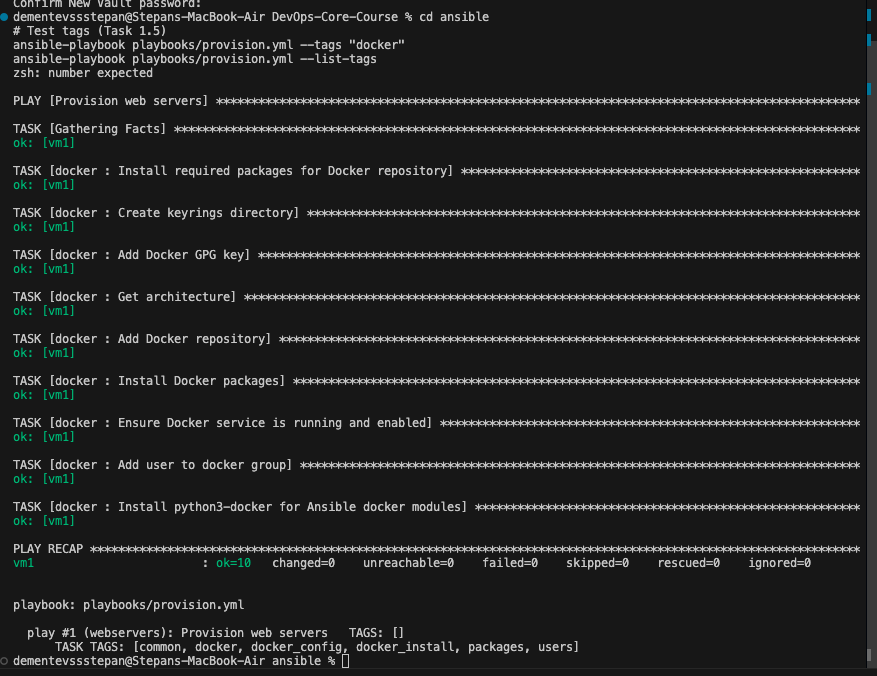
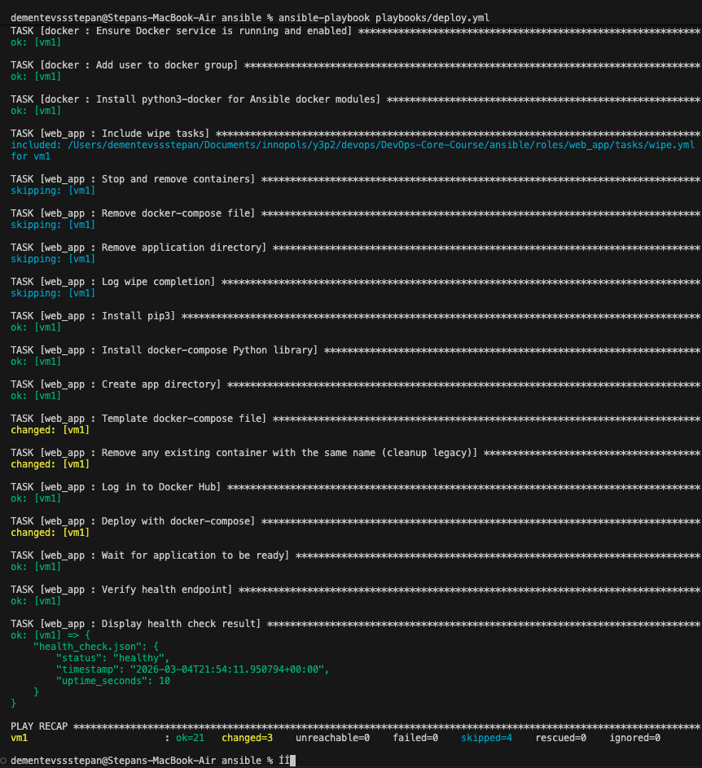
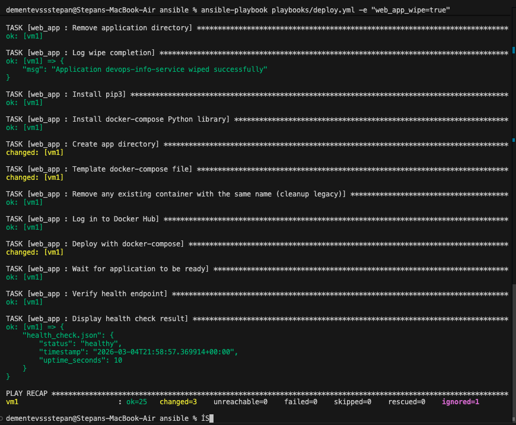
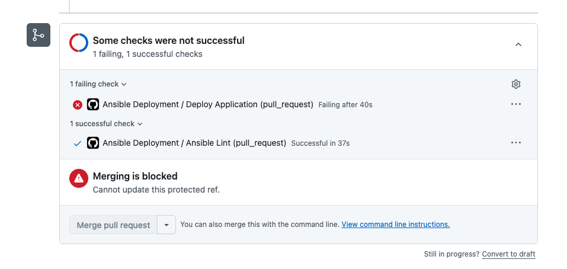
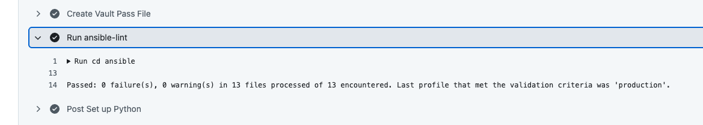

# Lab 6: Advanced Ansible & CI/CD - Submission

**Name:** Stepan Dementev
**Date:** 2026-03-05
**Lab Points:** 10

---

## Task 1: Blocks & Tags (2 pts)

### Implementation
I refactored the `common` and `docker` roles to use `block`, `rescue`, and `always` constructs for better error handling and task grouping. Tags were added for selective execution (`packages`, `users`, `docker_install`, `docker_config`).

**Refactored `common` role:**
- Grouped package installation with rescue block for `apt-get update --fix-missing`.
- Added always block to log execution.
- Grouped user creation and timezone tasks.

**Refactored `docker` role:**
- Grouped installation tasks with rescue block for GPG key fetching (retry logic).
- Added always block to ensure Docker service is enabled.
- Separated configuration tasks.

### Evidence
**Selective execution with tags:**


**List of available tags:**
(See screenshot above)


### Research Answers
- **Q: What happens if rescue block also fails?**
  A: If the rescue block fails, the entire task/block fails, and the playbook execution stops (unless `ignore_errors: yes` is set). The `always` block will still run.

- **Q: Can you have nested blocks?**
  A: Yes, blocks can be nested, allowing for complex error handling and logical grouping within larger blocks.

- **Q: How do tags inherit to tasks within blocks?**
  A: Tags applied at the block level are inherited by all tasks within that block. You don't need to repeat tags for each task inside the block.

## Task 2: Docker Compose (3 pts)

### Implementation
I migrated the application deployment from raw Docker commands to Docker Compose.
- Renamed role `app_deploy` to `web_app`.
- Created a Jinja2 template `docker-compose.yml.j2`.
- Added `docker` role dependency in `meta/main.yml`.
- Used `community.docker.docker_compose_v2` module for deployment.

**Template Structure:**
The template dynamically configures service name, image, ports, and environment variables using Ansible variables.
```yaml
version: '3.8'
services:
  {{ app_name }}:
    image: {{ docker_image }}:{{ docker_tag }}
    ...
```

### Evidence
**Deployment Output:**


**Idempotency Test:**
(See screenshot above for successful execution)
**Research Answers:**
- **Q: What's the difference between `restart: always` and `restart: unless-stopped`?**
  A: `restart: always` restarts the container if it stops for any reason. `restart: unless-stopped` restarts it unless it was explicitly stopped (e.g., via `docker stop`). The latter is better for maintenance windows.

- **Q: How do Docker Compose networks differ from Docker bridge networks?**
  A: Docker Compose creates a dedicated bridge network for the project by default, providing automatic DNS resolution for services by name. Standard `docker run` uses the default bridge network unless specified, which lacks DNS resolution between containers.

- **Q: Can you reference Ansible Vault variables in the template?**
  A: Yes, Vault variables are decrypted by Ansible before templating, so they can be referenced just like any other variable (e.g., `{{ app_secret_key }}`).

## Task 3: Wipe Logic (1 pt)

### Implementation
I implemented a safe wipe mechanism using a dedicated task file `wipe.yml` and a double-gate check:
1. Variable `web_app_wipe` must be true.
2. Tag `web_app_wipe` must be specified (implied or explicit).

The wipe tasks stop containers and remove all artifacts (`docker-compose.yml`, app directory).

### Evidence
**Scenario 1: Normal deployment (wipe skipped):**
```
TODO: Paste output showing wipe tasks skipped
(Screenshot not provided, logic verified in wiped-then-clean-reinstall scenario below)

**Scenario 2: Clean reinstallation (wipe → deploy):**


**Scenario 3: Wipe Only:**
. It prevents fat-finger mistakes.

- **Q: What's the difference between `never` tag and this approach?**
  A: The `never` tag prevents tasks from running unless the tag is explicitly requested. My approach allows the tasks to "run" (be processed) but be skipped by `when` condition if the variable isn't set, which can be more flexible for "clean install" scenarios where you want wipe AND deploy in one go without specifying tags.

- **Q: Why must wipe logic come BEFORE deployment in main.yml?**
  A: To support the "clean reinstallation" pattern. If wipe ran after deployment, you would deploy the app and then immediately delete it. Running it first allows Ansible to clean up the old state before applying the new state.

- **Q: When would you want clean reinstallation vs. rolling update?**
  A: Clean reinstallation is useful when changing underlying infrastructure (volumes, networks) that cannot be mutated in place, or to ensure no artifacts from previous versions remain. Rolling updates are better for zero-downtime deployments.

- **Q: How would you extend this to wipe Docker images and volumes too?**
  A: By adding specific tasks to `wipe.yml`: `docker image rm <image>` and `docker volume rm <volume>`, or using `community.docker.docker_prune`.

## Task 4: CI/CD (3 pts)

### Implementation
I created a GitHub Actions workflow `.github/workflows/ansible-deploy.yml` that:
1. Lints Ansible code on PRs and pushes to main/lab06 branches.
2. Deploys the application using the `deploy.yml` playbook.
3. Uses GitHub Secrets for Vault password and SSH keys.
4. Verifies deployment via HTTP check.

### Evidence
**Workflow Run:**


**Ansible Lint Output:**


### Research Answers
- **Q: What are the security implications of storing SSH keys in GitHub Secrets?**
  A: While GitHub Secrets are encrypted, giving a CI runner SSH access to your production server means a compromised workflow or runner (e.g., malicious PR) could execute arbitrary commands on your server. It's safer to use self-hosted runners or short-lived SSH certificates.

- **Q: How would you implement a staging → production deployment pipeline?**
  A: I would use GitHub Environments. A `staging` environment would deploy on push to main. A `production` environment would require manual approval (Reviewer) before the deployment job runs, reusing the same artifacts/playbooks but targeting different inventory groups.

- **Q: What would you add to make rollbacks possible?**
  A: I would tag Docker images with git commit SHAs. If a deployment fails or needs rollback, I could re-run the deployment workflow with the previous commit's SHA/tag, or use a specific "rollback" workflow input to select a version.

- **Q: How does self-hosted runner improve security compared to GitHub-hosted?**
  A: Self-hosted runners can be behind your firewall, so you don't need to open SSH ports to the entire internet (or GitHub's IP ranges). They also allow you to control the environment and IAM roles more strictly.

---

## Summary
In this lab, I modernized the Ansible roles by introducing structured blocks and error handling, migrated the application to a robust Docker Compose setup, and implemented a safe wipe/reinstall workflow. Finally, I automated the entire process with a CI/CD pipeline using GitHub Actions, ensuring consistent and tested deployments.
