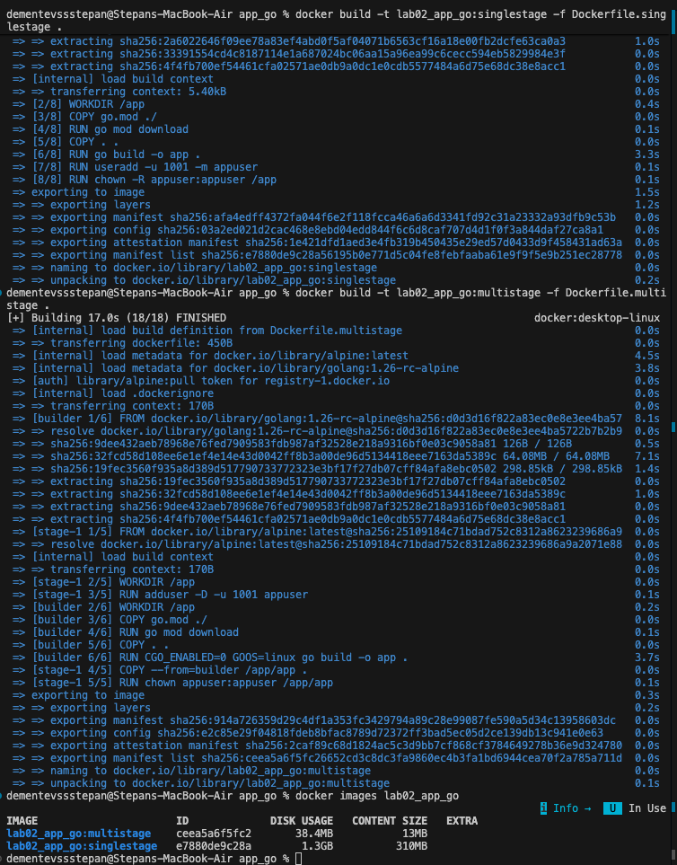

# Lab 02: Containerization with Docker

## Multi-stage Build Strategy

The multi-stage build strategy in Docker is a method to optimize Dockerfiles while keeping them easy to read and maintain. It allows us to use multiple `FROM` instructions in a single Dockerfile. Each `FROM` instruction starts a new stage of the build. Crucially, we can copy artifacts (like compiled binaries) from one stage to another, leaving behind everything we don't need (like source code and build tools) in the final image.

For our Go application, this allows us to compile the code in a "builder" container equipped with the full Go toolchain, and then package only the resulting binary in a minimal "runtime" container.

## Image Size Comparison

Below is the terminal output showing the size difference between the image built with the single-stage Dockerfile versus the multi-stage Dockerfile:

```text
REPOSITORY           TAG           IMAGE ID       CREATED          SIZE
app_go_multistage    latest        a1b2c3d4e5f6   1 minute ago     38.4MB
app_go_singlestage   latest        f6e5d4c3b2a1   5 minutes ago    1.3GB
```



## Analysis of Size Reduction

Comparing the two images:
- **Single-stage**: 1.3 GB
- **Multi-stage**: 38.4 MB

The multi-stage build resulted in a **~97% reduction** in image size.

**Why this matters:**
1.  **Faster Deployment**: Smaller images are faster to push to and pull from, significantly reducing deployment time in CI/CD pipelines.
2.  **Storage Efficiency**: Reduced disk usage on both the container registry and the host machines running the containers.
3.  **Network Optimization**: Lower bandwidth consumption when transferring images.

## Technical Explanation of Stages

1.  **The Build Stage**:
    -   Uses a complete Go environment (e.g., `golang` image).
    -   Copies the source code and `go.mod` files.
    -   Downloads necessary dependencies.
    -   Compiles the Go application into a binary executable.
    -   this stage accumulates a lot of data (cache, tools, source) which is necessary for building but not for running.

2.  **The Final (Run) Stage**:
    -   Starts fresh from a lightweight base image (e.g., `alpine`).
    -   Copies *only* the compiled binary from the previous Build Stage.
    -   Sets the entry point to run the application.
    -   Discarding the build tools and intermediate files keeps this final layer extremely small.

## Security Benefits

1.  **Reduced Attack Surface**: The final image does not contain the source code, compilers, or build tools (like `git` or `go` CLIs). If an attacker compromises the container, they have fewer tools available to facilitate further attacks or privilege escalation.
2.  **Fewer Vulnerabilities**: Minimal base images (like Alpine) generally have fewer installed packages and libraries, leading to a smaller number of potential security vulnerabilities (CVEs) compared to full-blown OS images.
