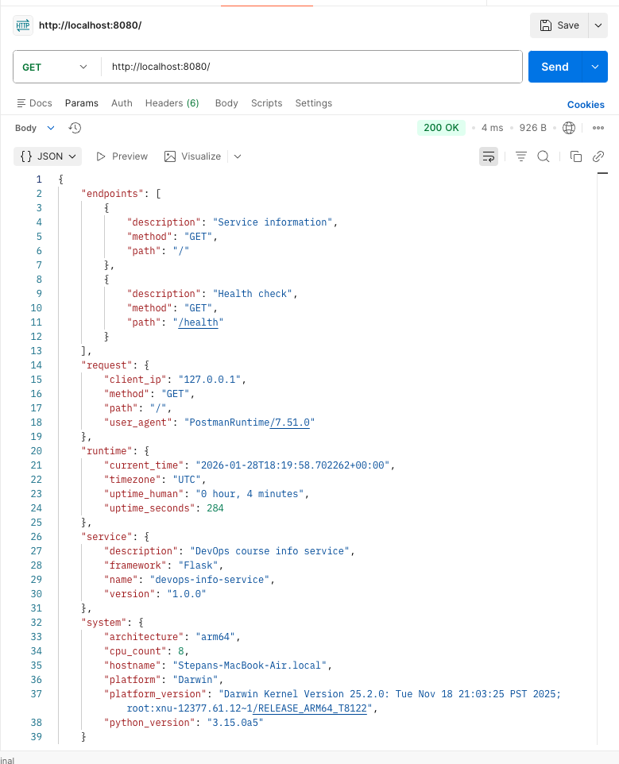

# Lab 1 - DevOps Info Service

## 1. Framework Selection

I chose **Flask** for this project.

### Why Flask?
1.  **Simplicity**: It's very easy to get started with. Minimal boilerplate code is needed to create a running application.
2.  **Flexibility**: It doesn't enforce a specific directory structure or dependencies.

### Comparison Table

| Feature | Flask | FastAPI | Django |
| :--- | :--- | :--- | :--- |
| **Type** | Micro-framework | Modern, Async Micro-framework | Full-stack Framework |
| **Learning Curve** | Low | Low-Medium | Medium-High |
| **Performance** | Good | Excellent (Async) | Good |
| **Best For** | Simple apps, prototyping | High performance APIs | Complex, DB-heavy apps |


## 2. Best Practices Applied

I tried to follow these best practices in my code:

1.  **Clean Code Organization**: I separated the logic into functions. The `app.py` is simple and readable. I used clear variable names.
2.  **Environment Variables**: The app uses `os.getenv` to read configuration like `PORT` and `DEBUG` mode. This is good for deployment later.
3.  **Logging**: I set up basic logging using the `logging` module. This helps in debugging and monitoring what the app is doing.
4.  **Error Handling**: I added handlers for 404 and 500 errors to return JSON responses instead of HTML, which is better for an API.
5.  **Project Structure**: separated requirements, added a readme, and gitignore.

## 3. API Documentation

### GET /
Returns information about the service and the system.

**Example Response:**
```json
{
  "endpoints": [
    {
      "description": "Service information",
      "method": "GET",
      "path": "/"
    },
    {
      "description": "Health check",
      "method": "GET",
      "path": "/health"
    }
  ],
  "request": {
    "client_ip": "127.0.0.1",
    "method": "GET",
    "path": "/",
    "user_agent": "curl/8.1.2"
  },
  "runtime": {
    "current_time": "2024-02-14T10:00:00+00:00",
    "timezone": "UTC",
    "uptime_human": "0 hour, 1 minutes",
    "uptime_seconds": 65
  },
  "service": {
    "description": "DevOps course info service",
    "framework": "Flask",
    "name": "devops-info-service",
    "version": "1.0.0"
  },
  "system": {
    "architecture": "arm64",
    "cpu_count": 8,
    "hostname": "mylaptop",
    "platform": "Darwin",
    "platform_version": "14.2.1",
    "python_version": "3.11.5"
  }
}
```

### GET /health
Used for health checks.

**Example Response:**
```json
{
  "status": "healthy",
  "timestamp": "2024-02-14T10:01:00+00:00",
  "uptime_seconds": 125
}
```

## 4. Testing Evidence

### Main Endpoint
*(Screenshot of accessing localhost:8080/ would go here)*

### Health Check
*(Screenshot of accessing localhost:8080/health would go here)*

## 5. Challenges & Solutions

**Challenge**: Getting the uptime correctly.
**Solution**: I recorded the `START_TIME` when the app starts, and then in each request, I subtract it from `datetime.now()` to get the delta.

**Challenge**: JSON formatting.
**Solution**: Flask's `jsonify` handles this automatically, which is nice.

## GitHub Community

I have starred the course repo and the recommended container project. Starring helps open source projects by giving them visibility and showing appreciation to the maintainers. Following developers is great because you can see what they are working on, learn from their code, and it helps in building a network in the tech community.

## 6. Screenshots



