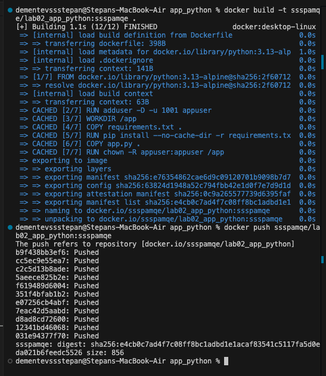
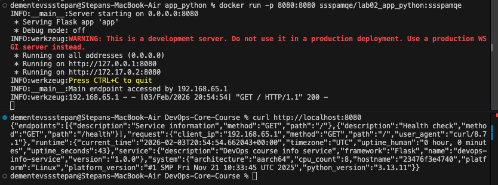

# Lab 2 - Docker Containerization

## Docker Best Practices

I followed several best practices to ensure the container is secure, efficient, and maintainable.

### 1. Base Image Selection
I used `python:3.13-alpine` as the base image.
**Why**: `alpine` images are extremely lightweight (based on Alpine Linux), leading to faster build times, smaller image sizes, and a reduced security attack surface.
```dockerfile
FROM python:3.13-alpine
```

### 2. Least Privilege User
I created a non-root user `appuser` and switched to it.
**Why**: Running as root is a security risk. I used `adduser` (Alpine syntax) to create a user.
```dockerfile
RUN adduser -D -u 1001 appuser
...
RUN chown -R appuser:appuser /app
USER appuser
```

### 3. Layer Caching
I copied `requirements.txt` and installed dependencies *before* copying the source code.
**Why**: Docker caches layers. Since source code changes frequently but dependencies change rarely, this prevents re-installing dependencies on every code change, significantly speeding up builds.
```dockerfile
COPY requirements.txt .
RUN pip install --no-cache-dir -r requirements.txt
COPY app.py .
```

### 4. No Cache
I used `--no-cache-dir` with pip.
**Why**: This prevents pip from saving downloaded packages to a cache directory, reducing the final image size.
```dockerfile
RUN pip install --no-cache-dir -r requirements.txt
```

### 5. Dockerignore
I included a `.dockerignore` file.
**Why**: This prevents unnecessary files (like `__pycache__`, `venv`, `.git`) from being sent to the Docker daemon and copied into the image. This reduces build context size and prevents secrets or junk from leaking into the image.

### 6. Production WSGI Server
I used `gunicorn` instead of the default Flask development server.
**Why**: The built-in Flask server is for development only and is not secure or performant enough for production. Gunicorn is a robust WSGI server that can handle multiple concurrent requests and manage worker processes effectively.
```dockerfile
CMD ["gunicorn", "--bind", "0.0.0.0:8080", "app:app"]
```

## Image Information & Decisions

### 1. Base Image
I chose `python:3.13-alpine`.
**Justification**: I needed the smallest possible image size for efficiency. Alpine Linux provides a minimal foundation without the overhead of standard Linux distributions.

### 2. Image Size
**Final Size**: 80 MB
**Assessment**: This is an excellent size for a web application. It is significantly smaller than the slim-based version (~210 MB), making it ideal for rapid scaling and deployment.

### 3. Layer Structure
The image is built in layers corresponding to the Dockerfile instructions.
- The **Base Layer** (Alpine + Python).
- The **Dependencies Layer** (`COPY requirements.txt` + `pip install`) is separate.
- The **Application Layer** (`COPY app.py`) is on top.
**Explanation**: Changes to code don't invalidate the dependency cache.

### 4. Optimization Choices
- **Alpine Linux**: Drastic size reduction.
- **No-cache**: `pip install --no-cache-dir`.
- **User**: Running as non-root `appuser`.

## Build & Run Process

### 1. Build And Push Image


### 2. Docker container running


### 3. Docker hub repository
https://hub.docker.com/repository/docker/ssspamqe/lab2_python_app/general


## Technical Analysis

### 1. Why does your Dockerfile work the way it does?
The Dockerfile executes instructions sequentially to build the image layer by layer. It starts with a lightweight `python:3.13-alpine` base, sets up the environment, creates a non-root user, and then installs dependencies. Crucially, I copy `requirements.txt` and install dependencies *before* copying the application code. Finally, it sets permissions and switches to the non-root user to run the application with Gunicorn.

### 2. What would happen if you changed the layer order?
If I were to copy the application code (`COPY . .` or `COPY app.py .`) *before* installing dependencies, Docker's layer caching mechanism would be less effective. Any change to the application code would invalidate the cache for that layer and all subsequent layers, causing `pip install` to run again on every build. By keeping dependencies separate and earlier, I ensure that `pip install` is only re-run when `requirements.txt` actually changes.

### 3. What security considerations did you implement?
- **Non-root User**: I created a specific user `appuser` and switched to it using `USER appuser`. This adheres to the principle of least privilege, preventing the application from having root access within the container.
- **Minimal Base Image**: Using Alpine Linux reduces the attack surface as it contains fewer pre-installed packages and tools than standard distributions.
- **Bytecode Compilation**: `PYTHONDONTWRITEBYTECODE=1` prevents Python from writing `.pyc` files, which keeps the container filesystem clean and read-only friendly.

### 4. How does .dockerignore improve your build?
My `.dockerignore` file excludes `__pycache__`, `.git`, local `venv`/`env` directories, and editor settings (`.vscode`).
- **Build Speed**: It reduces the context size sent to the Docker daemon.
- **Security**: It prevents sensitive files (like git history or local configs) from accidentally being copied into the image.
- **Consistency**: It ensures the container uses its own installed dependencies, not the local virtual environment.

## Challenges & Solutions

### 1. Python Production Server
**Issue**: The default Flask development server is not suitable for production due to security and performance limitations.
**Solution**: I switched to `gunicorn`, a robust WSGI HTTP server. This required modifying the `CMD` instruction in the Dockerfile to use gunicorn binding to all interfaces.
**Learning**: Understanding the difference between development (quick feedback) and production (stability/security) environments.

### 2. Minimizing Image Size with Alpine
**Issue**: Standard Python images can be quite large, leading to slower downloads and larger disk usage.
**Solution**: I migrated to the `python:3.13-alpine` image. This change decreased the image size by approximately 3 times (from ~200MB+ to ~80MB).
**Learning**: Alpine Linux offers a significant advantage in size and security surface reduction, making it ideal for containerized microservices.

### 3. Layer Caching and Security
**Issue**: Optimizing build times and securing the container runtime.
**Solution**: 
- **Layers**: I structured the Dockerfile to copy `requirements.txt` and install dependencies before copying the source code. This effectively uses Docker's layer caching mechanism.
- **Non-root**: I created an `appuser` and ensured file permissions were correct (`chown`). Using a non-root user adds a critical layer of security.
**Learning**: The importance of instruction ordering in Dockerfiles for cache efficiency and the necessity of the "Principle of Least Privilege".