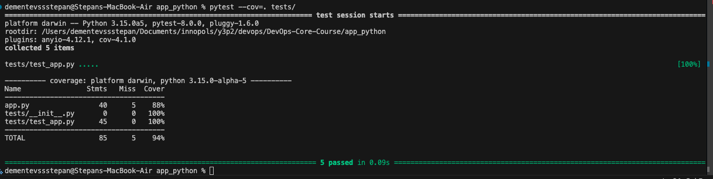
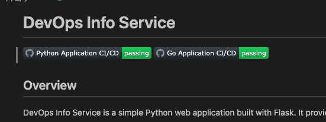

# Lab 03: CI/CD Pipeline Report

## 1. Overview
*   **Testing Framework:** `pytest`. Chosen for its simple syntax, powerful fixture system (used for Flask client), and rich plugin ecosystem (e.g., `pytest-cov`).
*   **Coverage:**
    *   **Endpoints:** `GET /` (content, JSON structure), `GET /health` (status, types).
    *   **Error Handling:** Custom 404 and 500 headers.
    *   **Logic:** Mocked system interactions (hostname/platform) to ensure deterministic tests.
*   **CI Trigger:** 
    *   On **Push**: to `main` and `lab03` branches.
    *   On **Pull Request**: to `main`.
    *   **Filter:** Path-based triggers (`app_python/**`) to isolate monorepo components.
*   **Versioning:** **SemVer** (e.g., `1.0.0`). Rationale: Industry standard that communicates the nature of changes (breaking vs. feature vs. patch) clearly to consumers.

## 2. Workflow Evidence
*   ✅ **Successful Workflow Run:** [GitHub Actions History](https://github.com/ssspamqe/DevOps-Core-Course/actions)
*   ✅ **Docker Image:** [ssspamqe/devops-info-service](https://hub.docker.com/r/ssspamqe/devops-info-service)
*   ✅ **Tests Passing Locally:**
    
*   ✅ **Status Badge:** 
    Added to README.md file:
    

## 3. Best Practices Implemented

*   **Dependency Caching:** Reduces build time by caching `pip` packages (approx. 40s -> 5s savings).
*   **Linting (Flake8):** Enforces PEP8 style and catches syntax errors before testing.
*   **Security (Access Tokens):** Uses `DOCKERHUB_TOKEN` instead of passwords for scoped, revocable access.
*   **Path-Based Triggers:** Prevents Python CI from running on Go app changes (Monorepo optimization).
*   **Job Separation:** Decouples "Build & Test" from "Docker Push" for better failure isolation.
*   **Snyk:** (Not configured in this lab run, but recommended for dependency scanning).

## 4. Key Decisions
*   **Versioning Strategy:** **SemVer**. Chosen to align with standard Docker tagging practices and to allow users to pin specific versions (e.g., `v1.0.0`) while knowing `latest` is unstable.
*   **Docker Tags:** The CI creates both `latest` (for convenience) and `1.0.0` (specific version). This balances ease of use with immutability.
*   **Workflow Triggers:** We restricted triggers to `app_python/**` to avoid wasting CI minutes when documentation or other apps (like `app_go`) are updated.
*   **Test Coverage:** We aim for high coverage (>80%) on application logic. Configuration code (e.g., `if __name__ == "__main__":`) is generally excluded or harder to reach in unit tests.

## 5. Challenges
*   **Version Injection:** Passing the version from the CI environment into the Docker container required using Docker Build Arguments (`ARG`/`ENV`) instead of just environment variables, as the build step happens in isolation.
*   **Monorepo Pathing:** Configuring linting and testing commands required careful directory management (`cd app_python`) to find the correct files.

## 6. Security Analysis (Snyk)
We integrated Snyk into our CI pipeline to continuously monitor our dependencies for security vulnerabilities.
Upon the initial scan, Snyk detected **3 issues** across **18 tested dependencies**.

### Vulnerabilities Found:
1.  **Direct Dependency:** `flask@3.1.0`
    *   **Issue:** Function Call With Incorrect Order of Arguments [Low Severity]
    *   **Fix:** Upgrade to `flask@3.1.1`
2.  **Transitive Dependency (via `gunicorn`):** `gunicorn@21.2.0`
    *   **Issue:** HTTP Request Smuggling [High Severity] (Two occurrences)
    *   **Fix:** Upgrade to `gunicorn@23.0.0`

### Remediation:
We updated `requirements.txt` to use the secure versions:
-   `Flask==3.1.1`
-   `gunicorn==23.0.0`

After applying these fixes, the Snyk scan passes successfully and the pipeline is secure.

