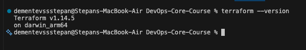
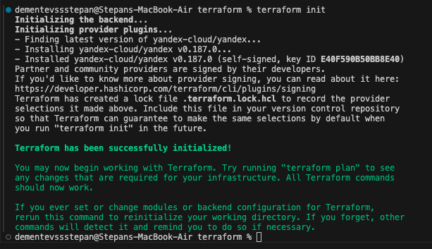
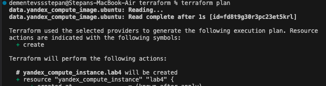
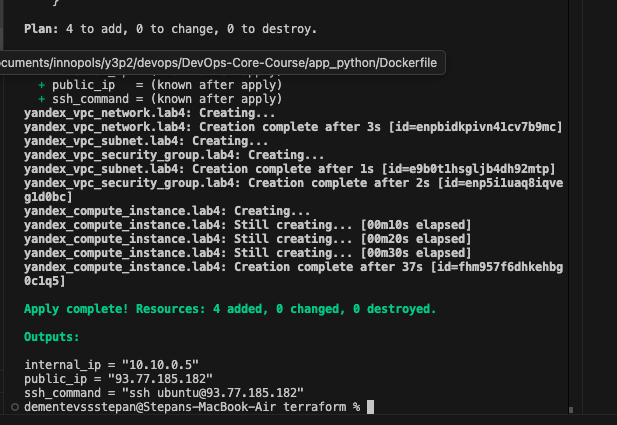
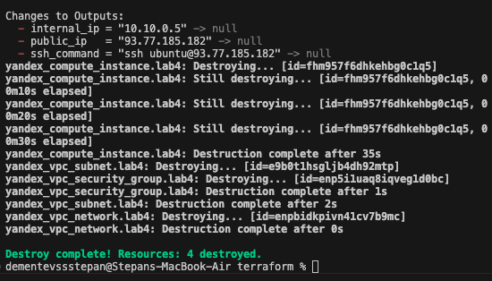
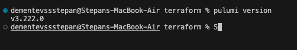
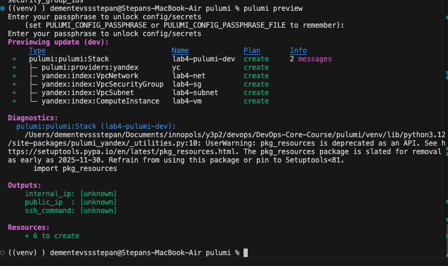
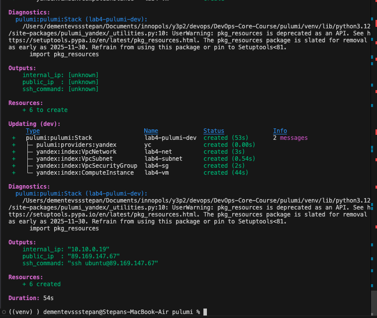
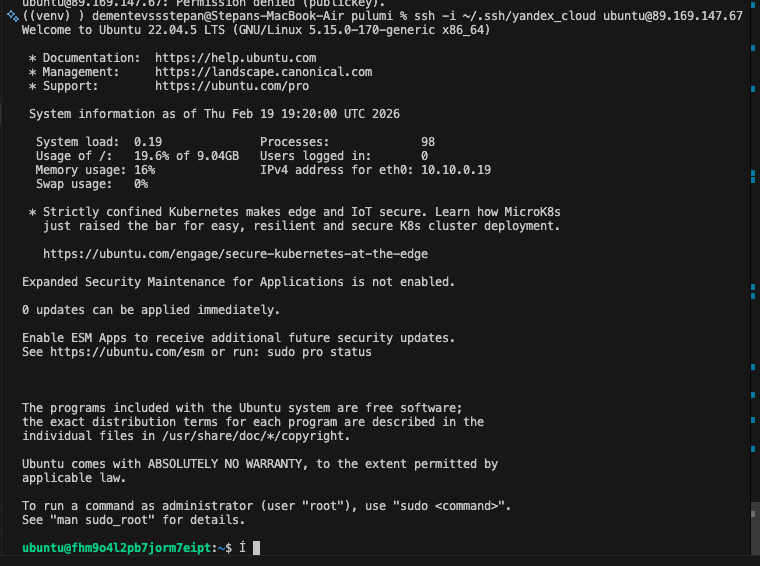

# Lab 4 — Infrastructure as Code (Terraform & Pulumi)

> Date: 2026-02-19

## 1. Cloud Provider & Infrastructure

- **Cloud provider:** Yandex Cloud (chosen due to regional availability and free tier).
- **Region/Zone:** ru-central1-a (update if different).
- **Instance type/size:** standard-v2, 2 vCPU (core_fraction=20%), 1 GB RAM.
- **Boot disk:** 10 GB (network-hdd).
- **Estimated cost:** $0 (free tier).
- **Resources created:**
  - VPC network
  - Subnet
  - Security group (ports 22, 80, 5000)
  - Compute instance
  - Public IP (NAT)

## 2. Terraform Implementation

- **Terraform version:** 1.14.5
  
- **Project structure:**
  - terraform/versions.tf
  - terraform/main.tf
  - terraform/variables.tf
  - terraform/outputs.tf
- **Key decisions:**
  - Separate VPC network/subnet and a security group for explicit ingress rules.
  - SSH access limited via `allowed_ssh_cidr` (recommended to set to your public IP).
  - VM metadata includes SSH public key for login.

**Command outputs:**

- `terraform init`

- `terraform plan` (sanitized)

- `terraform apply`

- `terraform destroy`

## 3. Pulumi Implementation

- **Pulumi version:** 

- **Language:** Python
- **Key differences vs Terraform:**
  - Imperative code in `pulumi/__main__.py`.
  - Config values set via `pulumi config set`.
  - Uses Pulumi state (default backend).

**Command outputs:**

- `pulumi preview`

- `pulumi up`

- `ssh ubuntu@<public_ip>`

## 4. Terraform vs Pulumi Comparison

- **Ease of Learning:** Terraform was easier to pick up initially because HCL is a small, purpose-built language with a limited set of constructs — you only need to learn resources, variables, and outputs. Pulumi requires you to already know a general-purpose language (Python in my case) plus the Pulumi SDK on top of it. However, if you already know Python well, Pulumi feels more natural after the initial setup hurdle. Overall, Terraform has a gentler learning curve for IaC beginners.

- **Code Readability:** Terraform's HCL is very declarative and reads almost like a configuration file, which makes it easy to scan and understand what infrastructure is being created. Pulumi code looks like a regular Python script, which is more verbose but also more flexible. For simple infrastructure like a single VM with a network, Terraform is more concise and readable. For complex logic with loops or conditionals, Pulumi would be clearer since you use native language features instead of HCL workarounds.

- **Debugging:** Debugging Terraform is straightforward — errors point to specific HCL blocks and line numbers, and `terraform plan` catches most issues before apply. Pulumi debugging was harder in practice: the `pulumi_yandex` SDK had mismatched parameter names (`ingress` vs `ingresses`, `network_interface` vs `network_interfaces`) that were not obvious from documentation and only surfaced at runtime. Python tracebacks are helpful, but finding the correct SDK argument names required inspecting source code. Terraform's validation step (`terraform validate`) catches more issues upfront.

- **Documentation:** Terraform has significantly better documentation thanks to its larger community and the Terraform Registry, where every provider has detailed examples. The Yandex Cloud Terraform provider docs are well-maintained with complete resource references. Pulumi's Yandex provider documentation is sparse and sometimes inaccurate — parameter names in examples did not match the actual SDK, which caused multiple errors during implementation. For mainstream providers (AWS, GCP), Pulumi docs are better, but for Yandex Cloud, Terraform wins by a large margin.

- **Use Case:** I would use Terraform for straightforward infrastructure provisioning where the team includes ops engineers who may not be developers — its declarative style and widespread adoption make it a safer default. I would choose Pulumi for projects where the infrastructure logic is complex (dynamic environments, multi-region deployments with conditionals) and the team is comfortable with Python/TypeScript. For this lab's Yandex Cloud setup, Terraform was the better fit due to superior provider support and documentation.

## 5. Lab 5 Preparation & Cleanup

- **Keeping VM for Lab 5:** Yes
- **If yes:** Which VM (Terraform or Pulumi)? Terraform
- **If no:** Plan for Lab 5 (local VM or recreate). 

**Cleanup evidence:**

Keeping Pulumi VM for Lab 5

## Screenshots / Evidence