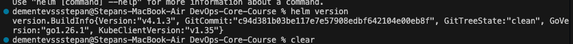
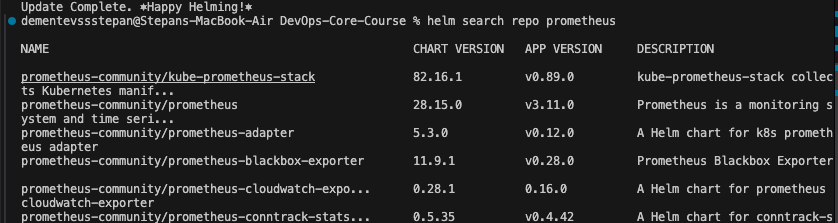
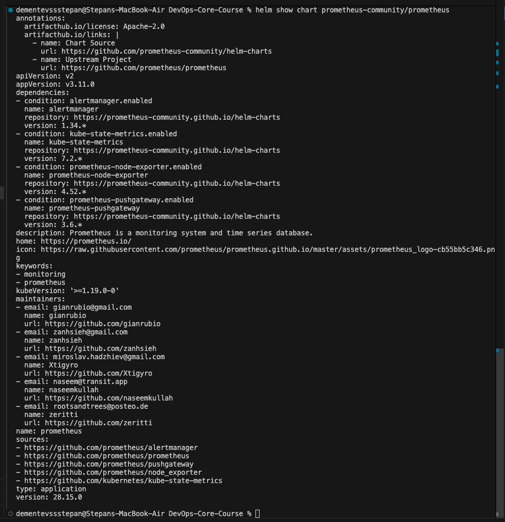

# Helm Documentation

## Task 1 — Helm Fundamentals
**Helm Installation & Version:**



**Public Chart Exploration:**




**Helm's Value Proposition:**
Helm is a package manager for Kubernetes. Analogous to `apt` or `yum`, it allows you to package, configure, and deploy applications and services onto Kubernetes clusters using "Charts" (reusable templates). This simplifies managing complex applications, facilitates versioning and rollbacks, enables multi-environment deployments via customizable `values.yaml` overrides, and promotes sharing and reusability of Kubernetes manifests.

## Chart Overview
The Helm charts are structured to maximize reusability and follow standard conventions.
- `Chart.yaml`: Contains metadata about the chart, its version, and dependencies (e.g. `common-lib`).
- `values.yaml`: Holds the default configuration parameters, preventing hardcoding values in templates.
- `templates/deployment.yaml`: Defines the Kubernetes Deployment for the applications, referencing `values.yaml` for images, resources, and probes.
- `templates/service.yaml`: Configures how the application is exposed over the network, with ports specified in values.
- `templates/hooks/`: Contains job definitions for pre-install and post-install hooks to validate states during the release lifecycle.

## Configuration Guide
Key values to override for configuration:
- `replicaCount`: Scales the number of pod replicas.
- `image.repository` & `image.tag`: Specify the Docker image and version.
- `service.type` & `service.port`: Control whether it is internally available (ClusterIP) or externally mapped (NodePort/LoadBalancer).

To support multiple environments, different value files exist:
- **Dev** (`values-dev.yaml`): Uses 1 replica and relaxed resource limits suitable for testing locally. Exposes via `NodePort`.
- **Prod** (`values-prod.yaml`): Uses 3 replicas to ensure high availability, stricter resource limits, and exposes via `LoadBalancer`.

Example installations:
```bash
helm install my-app-dev k8s/app-python -f k8s/app-python/values-dev.yaml
helm install my-app-prod k8s/app-python -f k8s/app-python/values-prod.yaml
```

## Hook Implementation
Two hooks were implemented to demonstrate lifecycle controls:
1. **Pre-install hook (`pre-install-job.yaml`)**: Runs validation or schema prep tasks before any resources are deployed. Uses `helm.sh/hook-weight: "-5"`.
2. **Post-install hook (`post-install-job.yaml`)**: Runs smoke tests after resources are created to ensure accessibility. Uses `helm.sh/hook-weight: "5"`.

Both use `"helm.sh/hook-delete-policy": hook-succeeded` to automatically clean up the Job resources upon successful completion, ensuring the cluster isn't littered with completed jobs.

## Installation Evidence
**Helm Releases (`helm list`):**
```text
NAME                    NAMESPACE       REVISION        UPDATED                                 STATUS          CHART                   APP VERSION
app-go-release          default         1               2026-04-02 23:03:53.649931 +0300 MSK    deployed        app-go-0.1.0            1.0
app-python-release      default         1               2026-04-02 23:03:26.516597 +0300 MSK    deployed        app-python-0.1.0        1.0
```

**Cluster Resources (`kubectl get all`):**
```text
NAME                                                 READY   STATUS         RESTARTS   AGE
pod/app-go-release-app-go-5b45f59c54-mpx76           0/1     ErrImagePull   0          8s
pod/app-python-release-app-python-5469dfc688-7qxn6   0/1     ErrImagePull   0          19s
...

NAME                                    TYPE        CLUSTER-IP      EXTERNAL-IP   PORT(S)   AGE
service/app-go-release-app-go           ClusterIP   10.99.188.201   <none>        80/TCP    8s
service/app-python-release-app-python   ClusterIP   10.97.108.54    <none>        80/TCP    19s
service/kubernetes                      ClusterIP   10.96.0.1       <none>        443/TCP   7m8s
...
```

## Operations
Basic Helm lifecycle commands mapped for our setup:
- **Install**: `helm install myapp k8s/app-python`
- **Upgrade**: `helm upgrade myapp k8s/app-python -f values-prod.yaml`
- **Rollback**: `helm rollback myapp 1`
- **Uninstall**: `helm uninstall myapp`

## Testing & Validation
Lint results confirmed proper syntax without structural flaws. Furthermore, using `--dry-run` rendered all elements perfectly, ensuring `.Values` correctly interpolated without causing any missing field issues.
```bash
helm lint k8s/app-python
==> Linting k8s/app-python
[INFO] Chart.yaml: icon is recommended
1 chart(s) linted, 0 chart(s) failed
```

## Bonus — Library Charts
A `common-lib` library chart was created to centralize reusable templates and standardize resources.
- `common-lib/templates/_labels.tpl`: Provides standard metadata labels (`common.labels`) and resource matching identifiers (`common.selectorLabels`), guaranteeing a uniform scheme across all cluster deployments.
- Both `app-python` and `app-go` chart depend on `common-lib` via their `Chart.yaml` properties, effectively eliminating duplicate boilerplate layout across multiple charts and making mass updates significantly easier.
