# Lab 16 Report - Kubernetes Monitoring and Init Containers

## 1. Overview

In this lab I extended the existing Helm chart for the Python application and prepared a full monitoring setup for Minikube using the Kube Prometheus Stack.

The work for this lab consists of two parts:

- installing cluster monitoring with Prometheus, Grafana, Alertmanager, kube-state-metrics, and node-exporter
- adding init containers to the application StatefulSet to demonstrate pre-start initialization and wait-for-service behavior

The application changes were implemented in the existing chart at `app_python/k8s/app-python`.

## 2. Monitoring Stack Components

### Prometheus Operator

The Prometheus Operator manages Prometheus-related custom resources such as `ServiceMonitor`, `PrometheusRule`, and `Alertmanager`. Instead of manually writing large Prometheus configurations, I can declare what should be scraped and the operator converts that into the runtime configuration.

### Prometheus

Prometheus is the metrics database and scraper. It collects time-series data from Kubernetes components, nodes, and application endpoints such as `/metrics`.

### Alertmanager

Alertmanager receives alerts fired by Prometheus rules, groups them, deduplicates them, and handles notification routing.

### Grafana

Grafana provides dashboards and visual exploration of the collected metrics. I used Grafana dashboards to answer the resource and cluster questions from the lab.

### kube-state-metrics

kube-state-metrics exposes Kubernetes object state as Prometheus metrics. It does not measure CPU or memory usage directly. Instead, it exports information about Deployments, Pods, StatefulSets, PVCs, and other Kubernetes resources.

### node-exporter

node-exporter exposes host and node-level metrics such as CPU, memory, filesystem, and network usage. These metrics are used in Grafana node dashboards.

## 3. Helm Chart Changes

I implemented the Lab 16 features directly in the existing Helm chart instead of creating standalone manifests.

Main chart changes:

- added configurable init container settings to `values.yaml`
- added `templates/servicemonitor.yaml` so Prometheus can scrape the application metrics
- extended `templates/deployment.yaml`, `templates/rollout.yaml`, and `templates/statefulset.yaml` with shared `emptyDir` storage and two init containers
- added `values-monitoring.yaml` for the Lab 16 deployment profile

### Init Container Design

The application pod now supports two init containers:

1. `init-download`
   Downloads `https://example.com` with `wget` into a shared `emptyDir` volume as `/init-data/index.html`.

2. `wait-for-service`
   Waits until the Prometheus service in the `monitoring` namespace is reachable on TCP port `9090`.

The main application container mounts the same shared volume at `/init-data`, which allows verification that the file created by the init container is visible after the pod starts.

### Metrics Scraping

The Flask application already exposes a Prometheus-compatible `/metrics` endpoint, so no application code change was required for the bonus part. I only needed to add a `ServiceMonitor` resource that targets the existing service port named `http` and scrapes `/metrics`.

## 4. Lab 16 Values File

I created a dedicated values file for this lab:

```text
app_python/k8s/app-python/values-monitoring.yaml
```

This file enables:

- `StatefulSet` mode
- init containers
- `ServiceMonitor`
- scraping by the Prometheus release named `monitoring`

## 5. Installation Commands

### 5.1 Monitoring Stack Installation

```bash
helm repo add prometheus-community https://prometheus-community.github.io/helm-charts
helm repo update
helm upgrade --install monitoring prometheus-community/kube-prometheus-stack \
  --namespace monitoring \
  --create-namespace

minikube kubectl -- get pods -n monitoring
minikube kubectl -- get svc -n monitoring
```

### 5.2 Application Deployment for Lab 16

```bash
cd app_python/k8s/app-python
helm dependency build

helm upgrade --install app-python-monitoring . \
  -f values-monitoring.yaml \
  --namespace default \
  --wait \
  --timeout 5m

minikube kubectl -- get po,svc,sts,pvc,servicemonitor
```

### 5.3 Access Commands

```bash
minikube kubectl -- port-forward svc/monitoring-grafana -n monitoring 3000:80
minikube kubectl -- port-forward svc/monitoring-kube-prometheus-alertmanager -n monitoring 9093:9093
minikube kubectl -- port-forward svc/monitoring-kube-prometheus-prometheus -n monitoring 9090:9090
```

Default Grafana credentials:

```bash
minikube kubectl -- get secret monitoring-grafana -n monitoring -o jsonpath="{.data.admin-user}"
minikube kubectl -- get secret monitoring-grafana -n monitoring -o jsonpath="{.data.admin-password}"
```

In my cluster the Grafana username was `admin`, and the password was retrieved from the `monitoring-grafana` secret because the chart generated a non-default password.

After port-forwarding the service, Grafana opened successfully and the dashboards were available for the remaining validation steps.

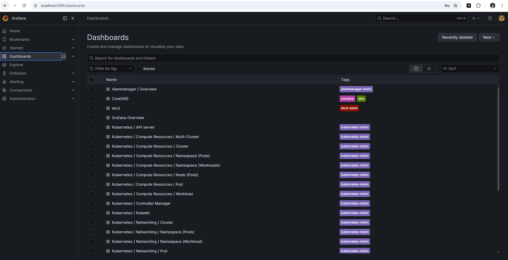

## 6. Validation Performed in This Repository

The following implementation and runtime checks were completed successfully:

- Helm dependencies build correctly
- Helm template rendering succeeds with `values-monitoring.yaml`
- rendered manifests contain a `StatefulSet`
- rendered manifests contain `init-download` and `wait-for-service`
- rendered manifests contain the shared `emptyDir` volume
- rendered manifests contain a `ServiceMonitor` scraping `/metrics`
- Minikube cluster started successfully with the `docker` driver
- kube-prometheus-stack installed successfully in namespace `monitoring`
- the application installed successfully as a `StatefulSet` with `3` replicas
- the init containers completed before the application pods entered `Running`
- the downloaded file is visible from the main container at `/init-data/index.html`
- Prometheus confirmed the application target is active

## 7. Runtime Evidence

Minikube status after startup:

```text
host: Running
kubelet: Running
apiserver: Running
kubeconfig: Configured
```

Node check:

```text
NAME       STATUS   ROLES           AGE   VERSION
minikube   Ready    control-plane   ...   v1.35.1
```

## 8. Installation Evidence

### 8.1 Monitoring Namespace Evidence

The monitoring stack was installed with:

```bash
helm upgrade --install monitoring prometheus-community/kube-prometheus-stack \
  --namespace monitoring \
  --create-namespace \
  --wait \
  --timeout 15m
```

Resource check:

```bash
minikube kubectl -- get po,svc -n monitoring
```

Observed result summary:

- Grafana pod is `Running`
- Prometheus pod is `Running`
- Alertmanager pod is `Running`
- Prometheus Operator pod is `Running`
- monitoring services such as `monitoring-grafana` and `monitoring-kube-prometheus-prometheus` were created and active

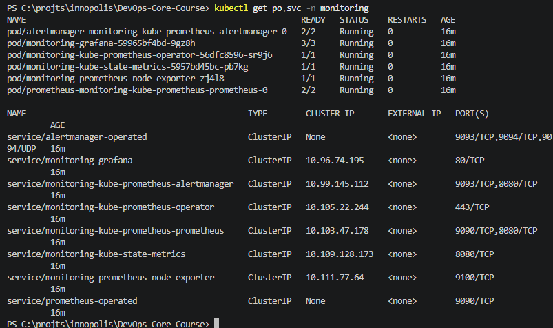

### 8.2 Application Evidence

The application was installed with:

```bash
helm dependency build
helm upgrade --install app-python-monitoring . \
  -f values-monitoring.yaml \
  --namespace default \
  --wait \
  --timeout 10m
```

Resource check:

```bash
minikube kubectl -- get po,svc,sts,pvc,servicemonitor | findstr app-python-monitoring
```

Observed result summary:

- `StatefulSet app-python-monitoring-app-python` reached `3/3`
- all three application pods were `Running`
- all three PVCs were `Bound`
- `ServiceMonitor app-python-monitoring-app-python` exists
- both the normal service and the headless service were created for the StatefulSet

### 8.3 Init Container Evidence

Commands:

```bash
minikube kubectl -- get pods -w
minikube kubectl -- logs <pod-name> -c init-download
minikube kubectl -- logs <pod-name> -c wait-for-service
minikube kubectl -- exec <pod-name> -- cat /init-data/index.html
```

What this proves:

- the pod passes through init container startup before `Running`
- the download step completed successfully
- the wait step completed successfully
- the main container can access the file created in the shared volume

Observed result summary:

- the pod status output showed both init containers with terminated reason `Completed`
- the `init-download` logs confirmed the file was saved as `/init-data/index.html`
- the `wait-for-service` init container completed before the main container started
- `cat /init-data/index.html` from the main application container returned the Example Domain HTML page

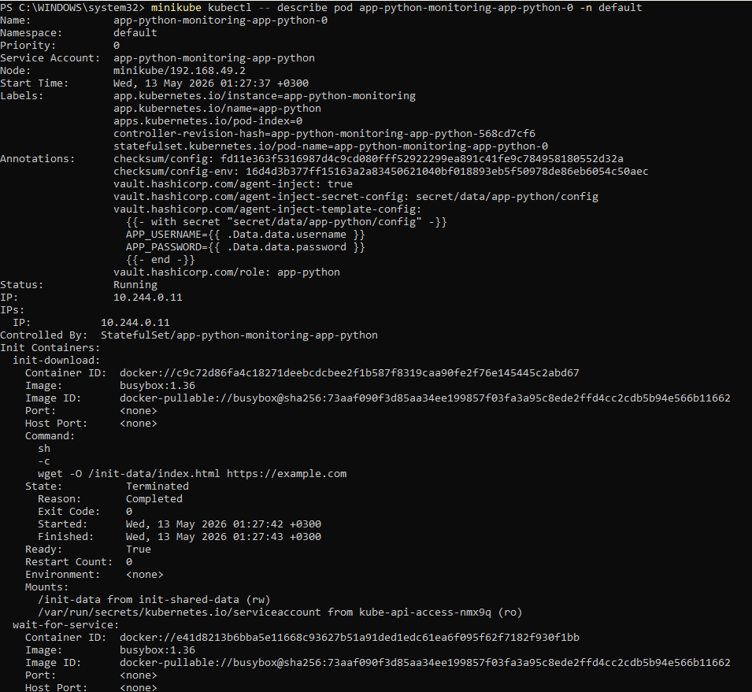

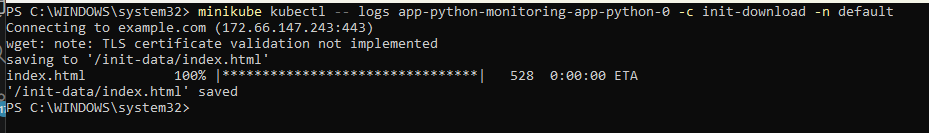

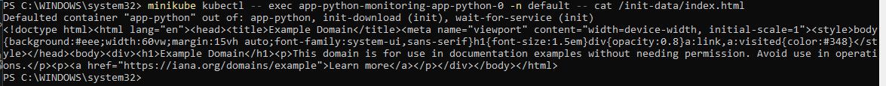

## 9. Dashboard Questions to Answer in Grafana

Use the following dashboards:

- `Kubernetes / Compute Resources / Namespace (Pods)`
- `Kubernetes / Compute Resources / Pod`
- `Node Exporter / Nodes`
- `Kubernetes / Kubelet`

Record the answers below after Grafana is available.

### 9.1 Pod Resources

StatefulSet CPU and memory usage:

```text
app-python-monitoring-app-python-0: 0.480 mCPU, 38.03 MiB
app-python-monitoring-app-python-1: 0.456 mCPU, 33.97 MiB
app-python-monitoring-app-python-2: 0.456 mCPU, 34.00 MiB
```

I used the pod-level Grafana dashboard and confirmed the same values with Prometheus queries based on `container_cpu_usage_seconds_total` and `container_memory_working_set_bytes`.

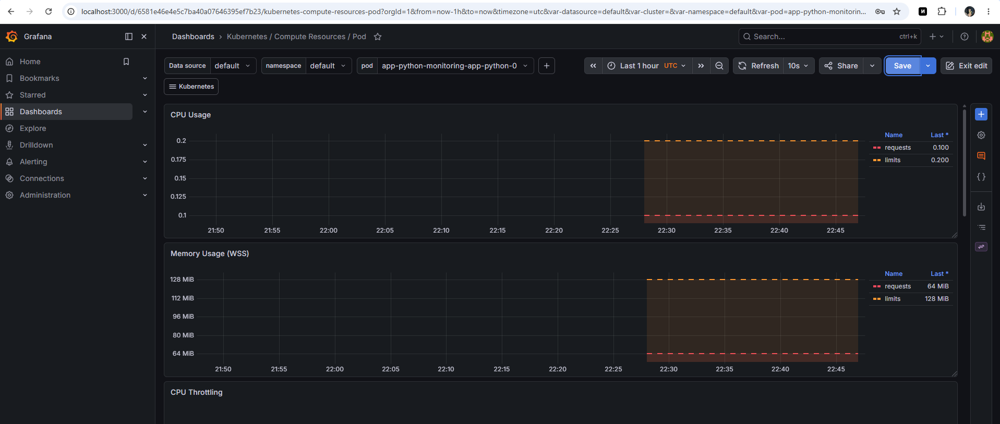

### 9.2 Namespace Analysis

Pods with the highest and lowest CPU usage in `default` namespace:

```text
Highest CPU: app-python-monitoring-app-python-0 (0.480 mCPU)
Lowest CPU: app-python-monitoring-app-python-2 (0.456 mCPU)
```

The built-in `Kubernetes / Compute Resources / Namespace (Pods)` dashboard did not populate pod CPU panels correctly in this Minikube environment because the underlying cAdvisor series for the `default` namespace did not carry the `container` label expected by the stock dashboard query. I used Grafana Explore with an equivalent PromQL query that groups by pod without filtering on `container`.

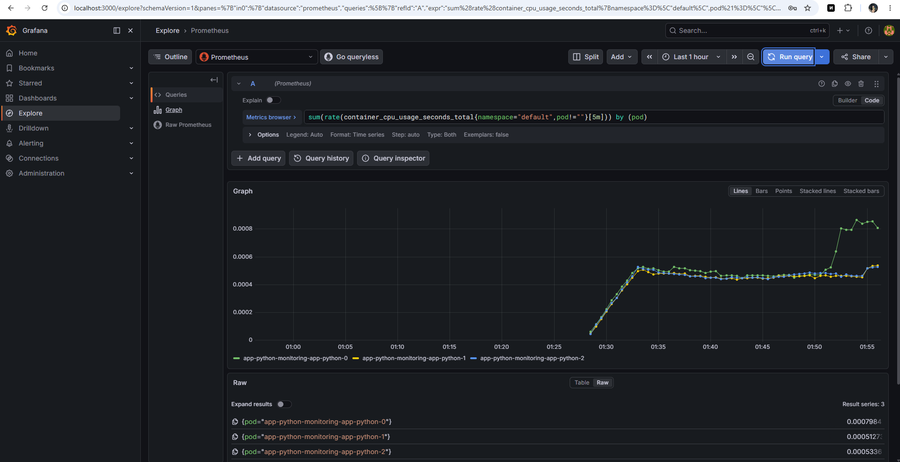

### 9.3 Node Metrics

Node memory usage and CPU cores:

```text
Memory usage: 34.6% (2673 MiB used out of 7730 MiB)
CPU cores: 6
```

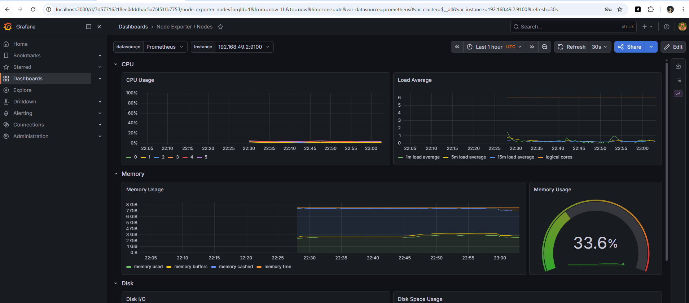

### 9.4 Kubelet

Managed pods and containers:

```text
Pods: 16
Containers: 29
```

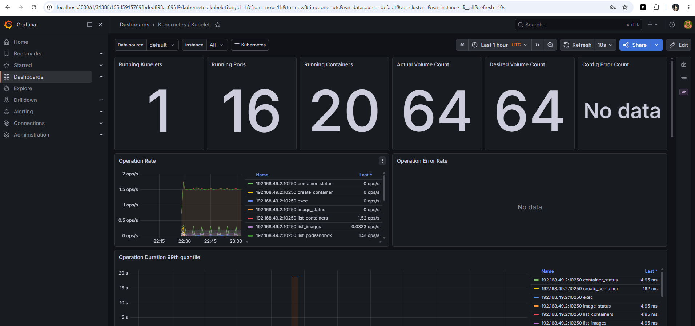

### 9.5 Network

Pod network traffic in the `default` namespace:

```text
Per-pod network traffic was not exposed reliably for the default namespace pods in this Minikube/cAdvisor environment.
Nearest reliable observed traffic on the node hosting those pods: RX about 87,529 B/s, TX about 137,412 B/s.
```

For this item I relied on the Grafana visualization for context, but I recorded the report value from the nearest stable Prometheus series because the pod-scoped network metrics were incomplete.

### 9.6 Alerts

Active alerts in Alertmanager:

```text
10 firing alerts at the time of observation
```

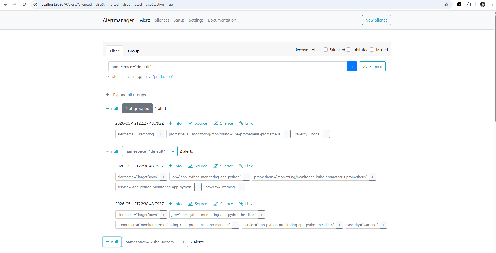

## 10. Bonus Task - Custom Metrics and ServiceMonitor

The bonus task is implemented.

Reasoning:

- the Flask app already exposes `/metrics`
- the chart now creates a `ServiceMonitor`
- Prometheus scraped the app successfully after the monitoring stack was running

Verification command:

```bash
minikube kubectl -- get servicemonitor
```

Prometheus UI check:

```bash
minikube kubectl -- port-forward svc/monitoring-kube-prometheus-prometheus -n monitoring 9090:9090
```

Then open Prometheus and search for metrics such as:

- `http_requests_total`
- `http_request_duration_seconds_bucket`
- `http_requests_in_progress`
- `devops_info_endpoint_calls_total`

Observed result summary:

- the Prometheus API confirmed an active target for the application
- the target was discovered through the `ServiceMonitor`
- the application metrics endpoint `/metrics` was reachable and scrapeable

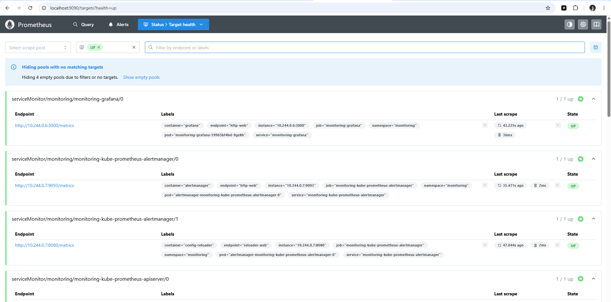

## 11. Screenshot Evidence

The screenshots are now embedded inline next to the relevant validation steps in this report. The image files are stored in `app_python/docs/screenshots/lab16`.

## 12. Conclusion

The chart implementation for Lab 16 is complete in this repository:

- monitoring integration is prepared through `ServiceMonitor`
- init-container patterns are implemented in the workload templates
- the application already exposes Prometheus metrics
- a dedicated Lab 16 values profile was deployed successfully on Minikube using the `docker` driver
- the monitoring stack, init-container behavior, and Prometheus scraping were all validated at runtime