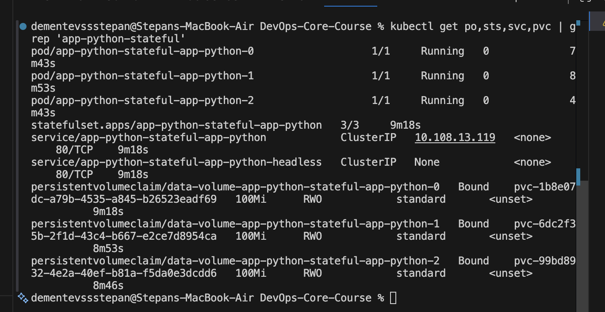
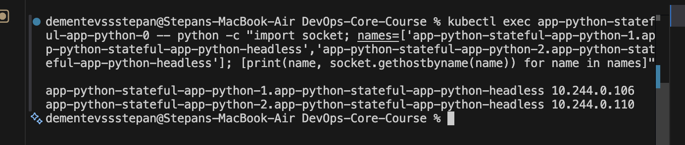
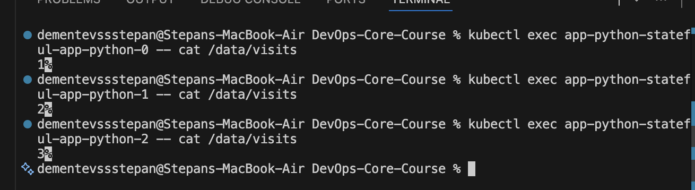
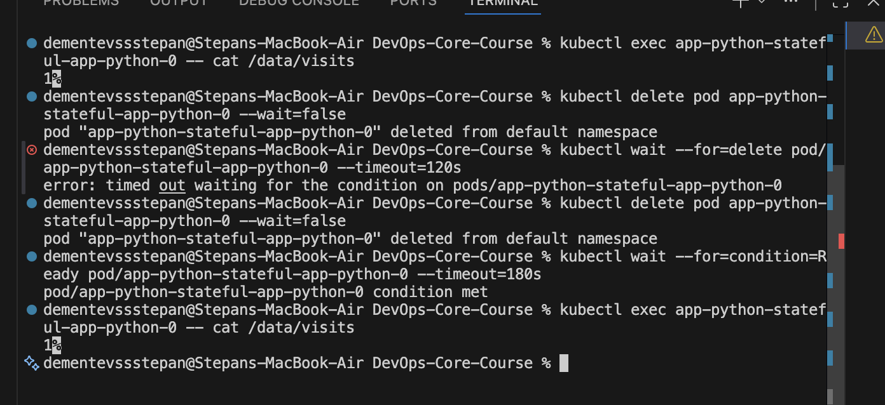
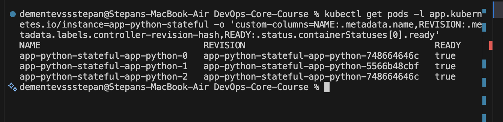
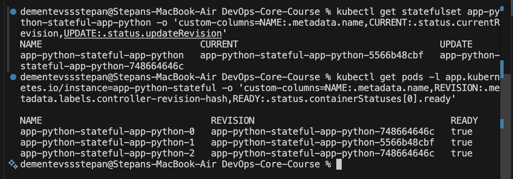

# Lab 15 Report - StatefulSets and Persistent Storage

## 1. Overview

In this lab I extended the existing Helm chart for the Python application and added a dedicated StatefulSet mode for workloads that require stable network identity and persistent per-pod storage.

The goal was to preserve the Deployment and Rollout templates from the previous labs while adding a separate chart path that creates:

- a Kubernetes `StatefulSet`
- a headless `Service`
- a separate PVC for every pod through `volumeClaimTemplates`

The lab was completed on `minikube` using the chart in `app_python/k8s/app-python`.

## 2. Why StatefulSet

I used a StatefulSet because this application stores the visit counter in `/data/visits`. With a regular Deployment, pods are interchangeable and their names are not stable. A StatefulSet is a better fit when each replica must keep its own identity and its own data.

Main StatefulSet guarantees:

- stable pod names such as `app-python-stateful-app-python-0`
- stable DNS identity through a headless service
- stable persistent storage for each pod
- ordered startup, scaling, and updates

### Deployment vs StatefulSet

| Feature | Deployment | StatefulSet |
|---------|------------|-------------|
| Pod naming | Random ReplicaSet suffix | Ordered ordinals: `-0`, `-1`, `-2` |
| Storage | Usually shared or external | One PVC per pod |
| Network identity | Ephemeral pod IP/name | Stable DNS per pod |
| Update order | Unordered rolling replacement | Ordered and strategy-aware |
| Typical use | Stateless web apps | Databases, queues, clustered systems |

Examples where StatefulSet is more appropriate:

- PostgreSQL or MySQL
- MongoDB
- Kafka or RabbitMQ
- Elasticsearch or Cassandra

## 3. Helm Chart Changes

I implemented the StatefulSet support directly in the existing chart rather than creating a separate set of standalone manifests.

Main changes:

- added `templates/statefulset.yaml`
- added `templates/headless-service.yaml`
- added helper `app-python.headlessServiceName`
- made `templates/pvc.yaml` conditional so it is skipped in StatefulSet mode
- made `templates/deployment.yaml` and `templates/rollout.yaml` skip rendering when StatefulSet mode is enabled
- added `values-statefulset.yaml` for the Lab 15 deployment
- added `values-statefulset-ondelete.yaml` for the bonus `OnDelete` test

The StatefulSet uses `volumeClaimTemplates`, so Kubernetes automatically created a separate claim for each replica instead of mounting a single shared PVC.

## 4. Headless Service and DNS

A headless service is a service with `clusterIP: None`. It does not provide the usual load-balanced virtual IP. Instead, it creates direct DNS records for the StatefulSet pods.

For this lab the DNS pattern was:

```text
<pod-name>.<headless-service-name>
```

In my deployment that became:

```text
app-python-stateful-app-python-1.app-python-stateful-app-python-headless
app-python-stateful-app-python-2.app-python-stateful-app-python-headless
```

DNS resolution test from pod `0`:

```bash
$ kubectl exec app-python-stateful-app-python-0 -- python -c "import socket; names=['app-python-stateful-app-python-1.app-python-stateful-app-python-headless','app-python-stateful-app-python-2.app-python-stateful-app-python-headless']; [print(name, socket.gethostbyname(name)) for name in names]"
app-python-stateful-app-python-1.app-python-stateful-app-python-headless 10.244.0.106
app-python-stateful-app-python-2.app-python-stateful-app-python-headless 10.244.0.107
```

This confirms that each pod has a stable DNS identity through the headless service.

## 5. Resource Verification

I deployed the chart with:

```bash
helm upgrade --install app-python-stateful . -f values-statefulset.yaml --wait --timeout 5m --no-hooks
```

Verification output:

```bash
$ kubectl get po,sts,svc,pvc | grep 'app-python-stateful'
pod/app-python-stateful-app-python-0                   1/1     Running   0               50s
pod/app-python-stateful-app-python-1                   1/1     Running   0               25s
pod/app-python-stateful-app-python-2                   1/1     Running   0               18s
statefulset.apps/app-python-stateful-app-python   3/3     50s
service/app-python-stateful-app-python            ClusterIP   10.108.13.119   <none>        80/TCP    50s
service/app-python-stateful-app-python-headless   ClusterIP   None            <none>        80/TCP    50s
persistentvolumeclaim/data-volume-app-python-stateful-app-python-0   Bound    pvc-1b8e07dc-a79b-4535-a845-b26523eadf69   100Mi      RWO            standard       <unset>                 50s
persistentvolumeclaim/data-volume-app-python-stateful-app-python-1   Bound    pvc-6dc2f35b-2f1d-43c4-b667-e2ce7d8954ca   100Mi      RWO            standard       <unset>                 25s
persistentvolumeclaim/data-volume-app-python-stateful-app-python-2   Bound    pvc-99bd8932-4e2a-40ef-b81a-f5da0e3dcdd6   100Mi      RWO            standard       <unset>                 18s
```

This output shows the expected StatefulSet behavior:

- pods are created with ordinal names
- the normal service still exists for application access
- the extra headless service exists for direct pod identity
- each pod has its own PVC

## 6. Per-Pod Storage Isolation

To prove that each pod has its own storage, I generated a different number of requests inside each pod and then read `/data/visits` from each replica.

Commands used:

```bash
kubectl exec app-python-stateful-app-python-0 -- python -c "import urllib.request; urllib.request.urlopen('http://127.0.0.1:8080/').read()"
kubectl exec app-python-stateful-app-python-1 -- python -c "import urllib.request; [urllib.request.urlopen('http://127.0.0.1:8080/').read() for _ in range(2)]"
kubectl exec app-python-stateful-app-python-2 -- python -c "import urllib.request; [urllib.request.urlopen('http://127.0.0.1:8080/').read() for _ in range(3)]"
```

Stored counter values:

```bash
$ printf 'pod-0 visits: ' && kubectl exec app-python-stateful-app-python-0 -- cat /data/visits
pod-0 visits: 1

$ printf 'pod-1 visits: ' && kubectl exec app-python-stateful-app-python-1 -- cat /data/visits
pod-1 visits: 2

$ printf 'pod-2 visits: ' && kubectl exec app-python-stateful-app-python-2 -- cat /data/visits
pod-2 visits: 3
```

Because the counts are different, the replicas are not sharing one common file. Each pod is writing to its own dedicated persistent volume.

## 7. Persistence After Pod Deletion

The next step was to verify that the data survives pod recreation.

I checked the value on pod `0`, deleted the pod, waited for the StatefulSet controller to recreate it, and checked the file again.

```bash
$ printf 'before restart: ' && kubectl exec app-python-stateful-app-python-0 -- cat /data/visits
before restart: 1

$ kubectl delete pod app-python-stateful-app-python-0 --wait=false
pod "app-python-stateful-app-python-0" deleted from default namespace

$ kubectl wait --for=condition=Ready pod/app-python-stateful-app-python-0 --timeout=180s
pod/app-python-stateful-app-python-0 condition met

$ printf 'after restart: ' && kubectl exec app-python-stateful-app-python-0 -- cat /data/visits
after restart: 1
```

The value stayed the same, which confirms that the data was preserved by the pod-specific PVC.

## 8. Bonus - Update Strategies

### 8.1 Partitioned Rolling Update

For the bonus task I configured the StatefulSet with:

```yaml
statefulset:
  updateStrategy:
    type: RollingUpdate
    rollingUpdate:
      partition: 2
```

I then changed the pod template through a Helm upgrade and compared controller revisions before and after the update.

```bash
before upgrade
NAME                               REVISION                                    READY
app-python-stateful-app-python-0   app-python-stateful-app-python-5566b48cbf   true
app-python-stateful-app-python-1   app-python-stateful-app-python-5566b48cbf   true
app-python-stateful-app-python-2   app-python-stateful-app-python-5566b48cbf   true

after upgrade
NAME                               REVISION                                    READY
app-python-stateful-app-python-0   app-python-stateful-app-python-5566b48cbf   true
app-python-stateful-app-python-1   app-python-stateful-app-python-5566b48cbf   true
app-python-stateful-app-python-2   app-python-stateful-app-python-fc5b98cf7    true
```

Only pod `2` was updated automatically. Pods `0` and `1` stayed on the older revision because their ordinals are below the configured partition value.

### 8.2 OnDelete Strategy

I also tested:

```yaml
statefulset:
  updateStrategy:
    type: OnDelete
```

After another Helm upgrade, Kubernetes created a new update revision for the StatefulSet, but none of the pods changed automatically.

```bash
after OnDelete upgrade
NAME                               REVISION                                    READY
app-python-stateful-app-python-0   app-python-stateful-app-python-5566b48cbf   true
app-python-stateful-app-python-1   app-python-stateful-app-python-5566b48cbf   true
app-python-stateful-app-python-2   app-python-stateful-app-python-fc5b98cf7    true

statefulset revisions
NAME                             CURRENT                                     UPDATE
app-python-stateful-app-python   app-python-stateful-app-python-5566b48cbf   app-python-stateful-app-python-748664646c
```

After deleting only pod `2`, only that pod moved to the new revision:

```bash
after deleting pod-2
NAME                               REVISION                                    READY
app-python-stateful-app-python-0   app-python-stateful-app-python-5566b48cbf   true
app-python-stateful-app-python-1   app-python-stateful-app-python-5566b48cbf   true
app-python-stateful-app-python-2   app-python-stateful-app-python-748664646c   true
```

This strategy is useful when an operator wants complete manual control over when individual pods are recreated.

## 9. Evidence

Screenshots for this lab were saved in `app_python/docs/screenshots/lab15/`.

Captured screenshots:

- `01-resources.png` - StatefulSet, pods, services, and PVCs
- `02-dns-resolution.png` - DNS resolution between StatefulSet pods through the headless service
- `03-per-pod-storage-isolation.png` - different visit counters on each pod
- `04-persistence.png` - visit counter preserved after deleting pod `0`
- `05-partition-update.png` - partitioned rolling update where only the highest ordinal pod changed revision
- `06-ondelete.png` - `OnDelete` strategy showing a newer update revision than the currently running pods

I did not include a separate screenshot of the Helm template source because the implementation is already present in the repository under `app_python/k8s/app-python/templates/statefulset.yaml`.

### Screenshot Attachments

#### Resource Verification



#### DNS Resolution



#### Per-Pod Storage Isolation



#### Persistence After Pod Restart



#### Partitioned Rolling Update



#### OnDelete Strategy



## 10. Commands Used

The main commands I used during the lab were:

```bash
minikube update-context
minikube start --driver=docker
helm dependency build
helm lint . -f values-statefulset.yaml
helm template app-python-stateful . -f values-statefulset.yaml
helm upgrade --install app-python-stateful . -f values-statefulset.yaml --wait --timeout 5m --no-hooks
kubectl get po,sts,svc,pvc
kubectl exec app-python-stateful-app-python-0 -- cat /data/visits
kubectl delete pod app-python-stateful-app-python-0
```

## 11. Conclusion

Lab 15 was completed successfully.

The chart now supports a real StatefulSet deployment with stable pod naming, a headless service, and a dedicated PVC for each replica. Validation on `minikube` confirmed that:

- pod-specific DNS resolution works
- each pod keeps an isolated visit counter
- data survives pod deletion and recreation
- partitioned rolling updates and `OnDelete` both work as expected

For this application, a StatefulSet is a better choice than a Deployment whenever per-replica visit data must remain attached to a specific pod identity.