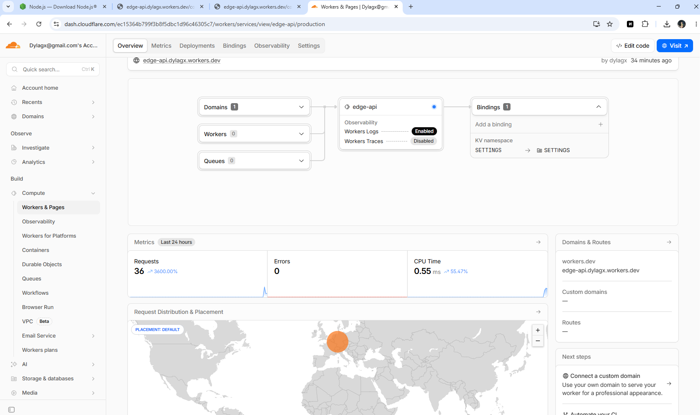
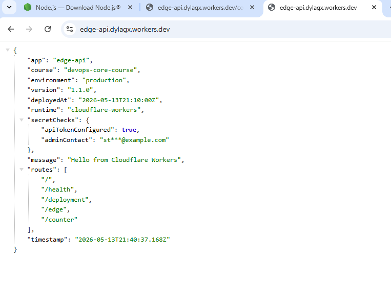
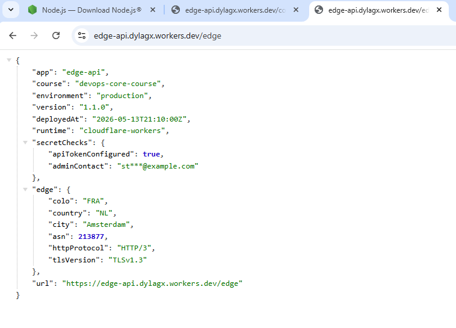
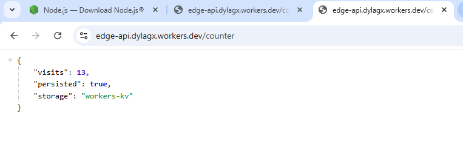
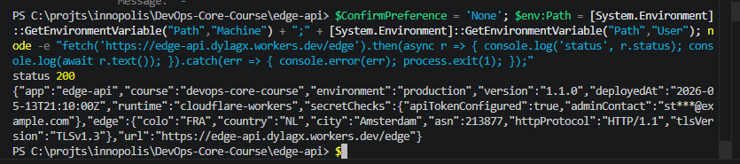
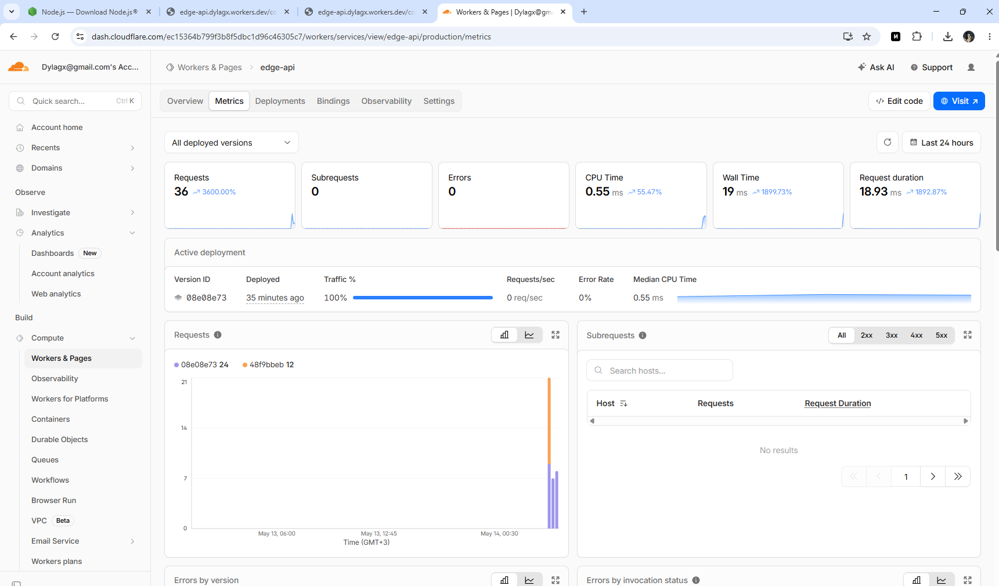
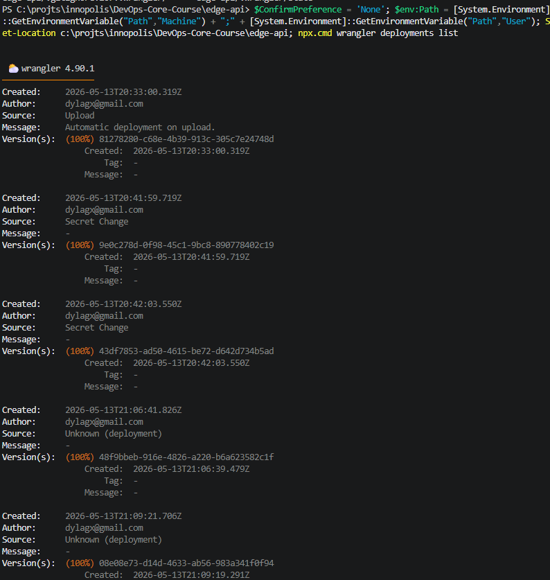

# Lab 17 Report - Cloudflare Workers Edge Deployment

## 1. Overview

In this lab I built and deployed a serverless HTTP API on Cloudflare Workers instead of using a Docker-based container platform.

The project was created with `create-cloudflare` in a new folder:

```text
edge-api/
```

The Worker was deployed to:

```text
https://edge-api.dylagx.workers.dev
```

## 2. Cloudflare Setup

I authenticated Wrangler with my Cloudflare account and verified access with:

```bash
npx wrangler whoami
```

Verified account context:

```text
Email: dylagx@gmail.com
Account ID: ec15364b799f3b8f5dbc1d96c46305c7
```

Cloudflare dashboard overview screenshot:



I used the generated `wrangler.jsonc` file as the main deployment configuration for:

- Worker name
- compatibility date
- plaintext variables
- KV binding
- observability settings

## 3. Project Structure

Main generated files used in this lab:

- `src/index.ts` - Worker route handler
- `wrangler.jsonc` - Cloudflare configuration
- `package.json` - local scripts for dev, deploy, test, and type generation
- `worker-configuration.d.ts` - generated Worker bindings types

## 4. Implemented API

The Worker exposes the following routes:

| Route | Purpose |
|------|---------|
| `/` | General Worker information |
| `/health` | Health status |
| `/deployment` | Deployment metadata |
| `/edge` | Cloudflare edge request metadata |
| `/counter` | KV-backed persistent counter |

### Example Route Behavior

`/health` returns:

```json
{
  "status": "ok",
  "service": "edge-api"
}
```

`/deployment` returns deployment metadata including:

- `app`
- `course`
- `environment`
- `version`
- `deployedAt`
- `runtime`

The deployed version at the end of this lab was:

```text
1.1.0
```

## 5. Local Development Verification

I ran the Worker locally with:

```bash
npm run dev
```

Local verification used the generated dev server on:

```text
http://127.0.0.1:8787
```

Verified locally:

- `/` returned Worker metadata and route list
- `/health` returned `200 OK`
- `/deployment` returned deployment metadata
- `/edge` returned edge-style request metadata in local dev
- `/counter` returned incrementing values and persisted during the session

I also added automated tests and ran:

```bash
npm test -- --run
```

Result:

```text
4 tests passed
```

## 6. Public Deployment Verification

I deployed the Worker with:

```bash
npm run deploy
```

Public Worker URL:

```text
https://edge-api.dylagx.workers.dev
```

Public root response screenshot:



Verified public routes:

- `/` returned `Hello from Cloudflare Workers`
- `/health` returned `status: ok`
- `/deployment` returned `environment: production` and `version: 1.1.0`
- `/edge` returned Cloudflare request metadata
- `/counter` returned a persistent visit counter

Example public checks:

```text
/health -> 200 OK
/deployment -> version 1.1.0
/counter after redeploy -> 5, then 6
```

## 7. Edge Behavior

The `/edge` route returns metadata from `request.cf`.

Fields used in this lab:

- `colo`
- `country`
- `city`
- `asn`
- `httpProtocol`
- `tlsVersion`

Observed production log example from `wrangler tail`:

```text
request { path: '/edge', colo: 'FRA', country: 'NL' }
```

Observed edge response fields included values such as:

```text
colo: FRA
country: NL
city: Amsterdam
asn: 213877
httpProtocol: HTTP/1.1
tlsVersion: TLSv1.3
```

Public `/edge` response screenshot:



### How Global Distribution Works

Cloudflare Workers runs code close to the incoming user request on Cloudflare's global network. I do not choose a fixed deployment region such as `eu-central-1` or `us-east-1`. Instead, Cloudflare distributes execution automatically.

This is different from VM or Kubernetes platforms, where I usually choose regions or clusters myself and then decide how to spread traffic between them.

That is why there is no explicit `deploy to 3 regions` step in Workers. The global distribution model is part of the platform.

### workers.dev vs Routes vs Custom Domains

- `workers.dev` provides a public URL quickly without owning a domain zone in Cloudflare.
- Routes attach a Worker to traffic for an existing Cloudflare-managed zone.
- Custom Domains make the Worker the origin for a full domain or subdomain.

## 8. Configuration, Secrets, and Persistence

### Plaintext Variables

I defined plaintext variables in `wrangler.jsonc`:

- `APP_NAME`
- `COURSE_NAME`
- `DEPLOYMENT_ENV`
- `WORKER_VERSION`
- `DEPLOYED_AT`

These values are appropriate for non-sensitive configuration. They are not suitable for secrets because plaintext vars are stored in configuration and are intended to be visible as deployment settings.

### Secrets

I created two Wrangler secrets:

- `API_TOKEN`
- `ADMIN_EMAIL`

The Worker uses them through the `env` object but does not expose the raw secret values publicly. Instead, it returns only safe derived information such as whether a token is configured and a masked contact string.

### Workers KV

I created and bound a KV namespace named `SETTINGS`.

Namespace IDs used:

```text
id: 315ad375a4af4b79aad531d505f18344
preview_id: 4c5e9e440422447da791f9c345e0d0da
```

The `/counter` endpoint stores the number of visits in KV under the key `visits`.

### Persistence Verification

I verified persistence by deploying the Worker, calling `/counter`, redeploying version `1.1.0`, and calling `/counter` again.

Observed values after redeploy:

```text
11
12
```

KV persistence screenshot after redeploy:



This proves the counter did not reset to `1` after redeployment, so the value persisted outside the Worker code bundle.

## 9. Observability and Operations

### Logs

I added a `console.log()` statement that records the request path and edge metadata.

I viewed live logs with:

```bash
npx wrangler tail
```

Observed example log entry:

```text
request { path: '/edge', colo: 'FRA', country: 'NL' }
```

Wrangler tail screenshot:



### Metrics

For metrics, the relevant Cloudflare dashboard page is the Worker overview and metrics section, where request count and error rate can be reviewed after generating traffic against the `workers.dev` URL.

During this lab I validated the Worker operationally through:

- successful public requests
- zero observed route errors during the final public verification
- deployment history in Wrangler
- production log tail output

Cloudflare metrics screenshot:



### Deployments and Rollback

I reviewed deployment history with:

```bash
npx wrangler deployments list
```

Observed result summary:

- total deployments listed: `5`
- latest version ID: `08e08e73-d14d-4633-ab56-983a341f0f94`

Deployment history screenshot:



Two explicit application versions used during the lab:

- `1.0.0`
- `1.1.0`

Rollback approach:

```bash
npx wrangler rollback
```

I kept `1.1.0` active as the final state because it contains the completed lab functionality, but Wrangler deployment history is available for rolling back to a previous version if needed.

## 10. Kubernetes vs Cloudflare Workers

| Aspect | Kubernetes | Cloudflare Workers |
|--------|------------|--------------------|
| Setup complexity | Higher, requires cluster, manifests, and service networking | Lower, single Worker project plus Wrangler |
| Deployment speed | Slower, builds and rollout steps are heavier | Very fast small bundle upload |
| Global distribution | Must be designed explicitly across clusters or regions | Built in to Cloudflare edge network |
| Cost for small apps | Usually higher because infrastructure is always present | Usually lower for lightweight APIs |
| State and persistence | PVCs, databases, external stores, ConfigMaps, Secrets | KV, D1, R2, Durable Objects, secrets and vars |
| Control and flexibility | Maximum control over runtime, networking, and workloads | More constrained runtime, less infrastructure control |
| Best use case | Complex systems, microservices, stateful workloads, custom networking | Small APIs, edge logic, request filtering, lightweight globally distributed services |

## 11. When to Use Each

### When Kubernetes Is Better

- multiple services with internal networking
- custom containers and full OS-level control
- stateful applications with more complex storage requirements
- workloads that need daemon processes, sidecars, or custom runtime behavior

### When Workers Is Better

- fast public APIs with low operational overhead
- request handling close to users globally
- lightweight edge logic such as redirects, metadata, filtering, and small JSON APIs
- projects where I want to avoid managing servers or clusters

### My Recommendation

For a small API like this lab, Cloudflare Workers is faster to set up and easier to publish globally than Kubernetes. For a large multi-service platform or applications that depend on custom containers, Kubernetes remains the more flexible choice.

## 12. Reflection

What felt easier than Kubernetes:

- project bootstrap was much faster
- public deployment required almost no infrastructure work
- edge metadata and routing were available immediately
- deployment history and logs were easy to access with Wrangler

What felt more constrained:

- no direct container/process control
- local behavior around secrets differs from deployed behavior
- state must be designed around platform bindings instead of local files or mounted volumes

What changed because Workers is not a Docker host:

- I wrote a Worker-native request handler instead of packaging an app in a container
- persistence moved to Workers KV instead of filesystem or PVC storage
- configuration and secrets came from Wrangler bindings rather than container environment injection and orchestration manifests