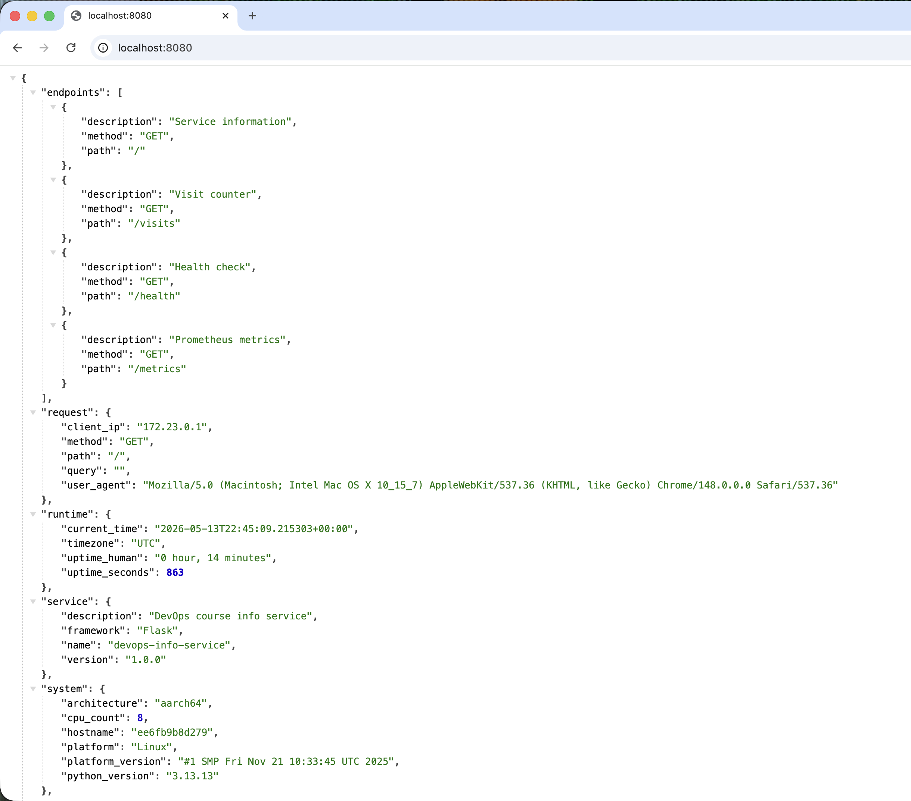
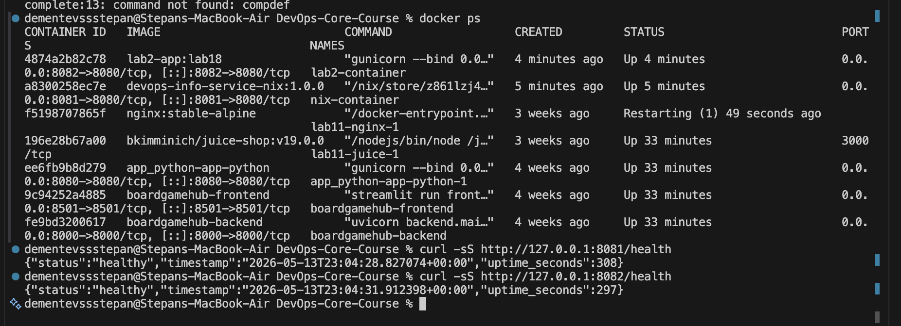

# Lab 18 Submission — Reproducible Builds with Nix

**Student:** Stepan Dementev  
**Repository:** DevOps-Core-Course  
**Platform used for this lab:** macOS 26.4.1, arm64  
**Nix version:** 2.34.7  
**Docker runtime:** Docker Desktop, linux/aarch64

## Task 1 — Reproducible Python App with Nix

### 1.1 Installation Check

I already had Nix installed on the workstation. Verification output:

```bash
$ command -v nix
/nix/var/nix/profiles/default/bin/nix

$ nix --version
nix (Nix) 2.34.7

$ uname -m
arm64
```

### 1.2 Prepared Application

For the lab I copied the Flask service from `app_python/` into `labs/lab18/app_python/` and kept the original application unchanged. The copied directory contains:

- `app.py`
- `requirements.txt`
- `Dockerfile`
- `default.nix`
- `docker.nix`
- `flake.nix`
- `flake.lock`

### 1.3 Nix Derivation

I created the following `default.nix`:

```nix
{ pkgs ? import <nixpkgs> {} }:

let
  pythonEnv = pkgs.python3.withPackages (ps: [
    ps.flask
    ps.gunicorn
    ps."python-json-logger"
    ps."prometheus-client"
  ]);
in
pkgs.stdenvNoCC.mkDerivation rec {
  pname = "devops-info-service";
  version = "1.0.0";

  src = ./.;
  nativeBuildInputs = [ pkgs.makeWrapper ];
  dontBuild = true;

  installPhase = ''
    runHook preInstall

    mkdir -p $out/app $out/bin
    cp app.py $out/app/app.py

    makeWrapper ${pythonEnv}/bin/gunicorn $out/bin/devops-info-service \
      --add-flags "--chdir $out/app" \
      --add-flags "--bind ''${HOST:-0.0.0.0}:''${PORT:-8080}" \
      --add-flags "app:app" \
      --set-default DEBUG "False" \
      --set-default VERSION "${version}" \
      --set-default VISITS_FILE "/tmp/devops-info-service/visits"

    runHook postInstall
  '';
}
```

### 1.4 Explanation of the Derivation

- `pythonEnv` builds a Python environment with all runtime dependencies from `nixpkgs`.
- `stdenvNoCC.mkDerivation` is enough because I am packaging an existing Python service rather than compiling native code.
- `makeWrapper` creates a stable executable entrypoint named `devops-info-service`.
- `--chdir $out/app` makes Gunicorn import `app:app` from the copied source directory.
- `VISITS_FILE` is redirected to `/tmp/devops-info-service/visits` so the Nix-built app can run locally without requiring `/data` on the host.

### 1.5 Build and Reproducibility Proof

Build command:

```bash
$ nix-build
/nix/store/ipb4fnijjycl6armvjh0s9ggpvsbchpk-devops-info-service-1.0.0
```

I rebuilt the derivation multiple times and compared both the store path and the output hash.

```bash
FIRST=/nix/store/ipb4fnijjycl6armvjh0s9ggpvsbchpk-devops-info-service-1.0.0
489fbdc7dac69aa72a36ac76cfbf968fa84d2926ac3d15274106ffc6fbc5e330

SECOND=/nix/store/ipb4fnijjycl6armvjh0s9ggpvsbchpk-devops-info-service-1.0.0
489fbdc7dac69aa72a36ac76cfbf968fa84d2926ac3d15274106ffc6fbc5e330

# after removing the store path and rebuilding from scratch
/nix/store/ipb4fnijjycl6armvjh0s9ggpvsbchpk-devops-info-service-1.0.0
489fbdc7dac69aa72a36ac76cfbf968fa84d2926ac3d15274106ffc6fbc5e330
```

Result: the store path and output hash remained identical. This is the main reproducibility property of Nix in practice.

### 1.6 Runtime Validation

I started the packaged service directly from the Nix result and checked the health endpoint.

```bash
$ ./result/bin/devops-info-service
[2026-05-14 01:29:40 +0300] [37214] [INFO] Starting gunicorn 23.0.0
[2026-05-14 01:29:40 +0300] [37214] [INFO] Listening at: http://0.0.0.0:8080 (37214)
```

```bash
$ curl -sS http://127.0.0.1:8080/health
{"status":"healthy","timestamp":"2026-05-13T22:29:47.659582+00:00","uptime_seconds":3}
```

### 1.7 Comparison: Lab 1 vs Lab 18

| Aspect | Lab 1 (`pip` + `venv`) | Lab 18 (`nix-build`) |
| --- | --- | --- |
| Python version | Depends on local system | Pulled from `nixpkgs` |
| Dependency source | PyPI at install time | Exact `nixpkgs` package set |
| Dependency tree | Usually direct dependencies only | Full closure pinned |
| Build output path | No content hash | Content-addressed store path |
| Rebuild result | Environment-dependent | Identical output for same inputs |
| Local setup | Manual `venv` activation | Single build command |

### 1.8 Why `requirements.txt` Gives Weaker Guarantees

`requirements.txt` is weaker because it only describes Python packages at the package-manager level. It does not fully capture:

- the exact Python interpreter build,
- the complete transitive dependency graph in a single immutable closure,
- the host system libraries,
- the build environment used to produce the final executable layout.

Nix captures all of these inputs in the derivation hash. That is why the output store path stayed identical across repeated builds.

### 1.9 Reflection

If I had used Nix in Lab 1 from the start, I would not have needed to manually create a virtual environment or rely on the host Python installation. The whole service environment would have been described in code and reproducible on another machine immediately.



## Task 2 — Reproducible Docker Images with Nix

### 2.1 Original Dockerfile from Lab 2

The traditional Docker image used the following Dockerfile:

```dockerfile
FROM python:3.13-alpine

RUN adduser -D -u 1001 appuser

WORKDIR /app

ARG VERSION=1.0.0

ENV PYTHONDONTWRITEBYTECODE=1 \
    PYTHONUNBUFFERED=1 \
    HOST=0.0.0.0 \
    PORT=8080 \
    DEBUG=False \
    VERSION=${VERSION}

COPY requirements.txt .
RUN pip install --no-cache-dir -r requirements.txt

COPY app.py .
RUN mkdir -p /data && chown -R appuser:appuser /app /data

USER appuser
EXPOSE 8080
CMD ["gunicorn", "--bind", "0.0.0.0:8080", "app:app"]
```

### 2.2 Nix Docker Image Definition

I created the following `docker.nix`:

```nix
{ pkgs ? import <nixpkgs> {} }:

let
  app = import ./default.nix { inherit pkgs; };
in
pkgs.dockerTools.buildLayeredImage {
  name = "devops-info-service-nix";
  tag = "1.0.0";
  created = "1970-01-01T00:00:01Z";

  contents = [ app ];

  config = {
    Cmd = [ "${app}/bin/devops-info-service" ];
    Env = [
      "HOST=0.0.0.0"
      "PORT=8080"
      "DEBUG=False"
      "VERSION=1.0.0"
      "VISITS_FILE=/data/visits"
    ];
    ExposedPorts = {
      "8080/tcp" = {};
    };
    WorkingDir = "/";
  };
}
```

### 2.3 Nix Docker Build Results

The tarball build became stable once the application result path was stable.

```bash
$ nix-build docker.nix
/nix/store/gfp03dpxcfh6w8ngmlnr5x2a8shdr8lv-devops-info-service-nix.tar.gz

$ sha256sum result
9590f77c63af142da052441b8845b95253eb2dc9b5127601e472284a2bbaa99b  result

$ rm result && nix-build docker.nix && sha256sum result
9590f77c63af142da052441b8845b95253eb2dc9b5127601e472284a2bbaa99b  result
```

That proved deterministic output for the host-local build, but the first tarball was not runnable because it was built from the macOS host closure.

To produce a real Linux container image on the same machine, I rebuilt `docker.nix` inside a Linux `nixos/nix` container and exported the tarball back into the workspace:

```bash
$ docker run --rm -v "$PWD":/workspace -w /workspace nixos/nix:latest sh -lc 'out=$(nix-build docker.nix --no-out-link); cp "$out" /workspace/devops-info-service-nix-linux.tar.gz && echo "$out"'
/nix/store/9fnq4g5k6fil3y5pjxvaxc8cs0g4rrp9-devops-info-service-nix.tar.gz

$ sha256sum devops-info-service-nix-linux.tar.gz
4a468e466126610aad0adcde8e20c68bfb13b18eff24e38350efc0e8ab2df674  devops-info-service-nix-linux.tar.gz
```

Image metadata after loading the Linux-built tarball into Docker:

```bash
$ docker inspect --format '{{.Created}} {{.Os}}/{{.Architecture}} {{.Size}}' devops-info-service-nix:1.0.0
1970-01-01T00:00:01Z linux/arm64 198803119
```

### 2.4 Traditional Dockerfile Comparison

I built the traditional image twice and compared the exported archive hashes and resulting image IDs.

```bash
$ docker save lab2-app:test1 | shasum -a 256
d9d6ccef728aeca286974024a419325736c01015e686d63b616df4c549802c2b

$ docker save lab2-app:test2 | shasum -a 256
2588893543a64d01633edf3e324d3f443ee52eb1ccf888636366f6dc077c11bf
```

```bash
$ docker image inspect --format '{{.Id}} {{.Created}}' lab2-app:test1
sha256:0d990dca0a9bdbe173bb85dd6d753f605ca8216d3c5cc5b4ac706dc4f99e17eb 2026-05-13T22:32:26.084008881Z

$ docker image inspect --format '{{.Id}} {{.Created}}' lab2-app:test2
sha256:4353bc1bb1bd3a929183c631eceed7e4bf4e7a509267b03e8c66ef1f9e37ff52 2026-05-13T22:32:26.084008881Z
```

This shows that the Dockerfile build output changed even though the source and visible creation timestamp did not. In practice Docker still carries metadata outside the scope of my application source, while Nix ties the output to explicit derivation inputs.

### 2.5 Size and History Comparison

```bash
$ docker images --format '{{.Repository}}:{{.Tag}} {{.Size}}' | grep -E '^(lab2-app:lab18|devops-info-service-nix:1.0.0) '
lab2-app:lab18 93MB
devops-info-service-nix:1.0.0 430MB
```


Compact history for the traditional Docker image:

```text
CMD ["gunicorn" "--bind" "0.0.0.0:8080" "app… | 0B
EXPOSE [8080/tcp] | 0B
USER appuser | 0B
RUN mkdir -p /data && chown -R appuser:appuser /app /data | 28.7kB
COPY app.py . | 20.5kB
RUN pip install --no-cache-dir -r requirements.txt | 15.3MB
COPY requirements.txt . | 12.3kB
...
```

Compact history for the Nix image:

```text
customisation-layer | 20.5kB
devops-info-service | 41kB
python3-env | 1.64MB
python3.13-flask | 1.35MB
python3.13-werkzeug | 3.06MB
python3.13-gunicorn | 1.39MB
python3.13-prometheus-client | 1.04MB
python3-3.13.12 | 122MB
apple-sdk-14.4 | 420MB
clang-21.1.8-lib | 303MB
llvm-21.1.8-lib | 399MB
...
```

### 2.6 Runtime Validation with a Linux Nix Builder Container

Instead of moving to another machine, I used Docker Desktop itself as the Linux build environment by running `nixos/nix:latest`, mounting the lab directory, and exporting the Linux-built tarball back to the host.

After that, the tarball loaded into Docker successfully:

```bash
$ docker load < devops-info-service-nix-linux.tar.gz
Loaded image: devops-info-service-nix:1.0.0
```

I then started both containers side by side on free host ports:

```bash
$ docker run -d --name nix-container -p 8081:8080 devops-info-service-nix:1.0.0
$ docker run -d --name lab2-container -p 8082:8080 lab2-app:lab18
```

Verification output:

```bash
$ docker ps
lab2-container  Up ...  0.0.0.0:8082->8080/tcp  lab2-app:lab18
nix-container   Up ...  0.0.0.0:8081->8080/tcp  devops-info-service-nix:1.0.0

$ curl -sS http://127.0.0.1:8081/health
{"status":"healthy","timestamp":"2026-05-13T22:59:50.344154+00:00","uptime_seconds":30}

$ curl -sS http://127.0.0.1:8082/health
{"status":"healthy","timestamp":"2026-05-13T22:59:50.353439+00:00","uptime_seconds":15}
```

### 2.7 Analysis

Why traditional Dockerfiles do not provide the same guarantees as Nix:

- the Dockerfile depends on an external mutable base tag, `python:3.13-alpine`,
- Python packages are resolved via `pip` during image build,
- Docker output includes engine-side metadata and builder behavior,
- the full dependency closure is not described as a single content-addressed derivation.

What I learned from the macOS attempt:

- the host-local `docker.nix` build was deterministic but not runnable because it carried a Darwin closure,
- a correct Linux image can still be produced on macOS if the Nix build itself runs in a Linux environment,
- using a Linux `nixos/nix` container is a practical workaround when a separate Linux host is unavailable.

### 2.8 Reflection

If I redid Lab 2 with Nix, I would keep the deterministic timestamp and content-addressed closure, but I would make the builder platform explicit from the beginning. The experiment showed that the build remains reproducible, but the container must be built from a Linux closure if it is meant to run under Docker's Linux runtime.

### 2.9 Screenshot Placeholder

This screenshot can be taken from the terminal output produced after starting both containers successfully:

```text
Target file: labs/lab18/screenshots/task2_nix_and_lab2_containers.png
Suggested content: terminal showing `docker ps` with `lab2-container` on port 8082 and `nix-container` on port 8081, plus both `/health` responses
```



## Bonus — Nix Flakes

### Bonus.1 Flake Definition

I created the following `flake.nix`:

```nix
{
  description = "DevOps Info Service reproducible build with Nix";

  inputs = {
    nixpkgs.url = "github:NixOS/nixpkgs/nixpkgs-unstable";
  };

  outputs = { self, nixpkgs }:
    let
      lib = nixpkgs.lib;
      systems = [
        "x86_64-linux"
        "aarch64-linux"
        "x86_64-darwin"
        "aarch64-darwin"
      ];
      forEachSystem = lib.genAttrs systems;
    in
    {
      packages = forEachSystem (system:
        let
          pkgs = import nixpkgs { inherit system; };
        in
        {
          default = import ./default.nix { inherit pkgs; };
          dockerImage = import ./docker.nix { inherit pkgs; };
        });

      devShells = forEachSystem (system:
        let
          pkgs = import nixpkgs { inherit system; };
        in
        {
          default = pkgs.mkShell {
            packages = with pkgs; [
              python3
              python3Packages.flask
              python3Packages.gunicorn
              python3Packages."python-json-logger"
              python3Packages."prometheus-client"
            ];
          };
        });
    };
}
```

### Bonus.2 Lock File Evidence

I generated `flake.lock` with `nix flake update`. The important locked input is:

```json
{
  "locked": {
    "owner": "NixOS",
    "repo": "nixpkgs",
    "rev": "eef00dfd8a712b34af845f9350bac681b1228bd1",
    "narHash": "sha256-Blg88K1jwG+P0Mr27+rKMFCufdrWkV3wWh9AdYtz0FQ="
  }
}
```

This improves reproducibility over plain `default.nix`, because the package set is no longer taken from whatever `<nixpkgs>` happens to point to on the local machine.

### Bonus.3 Flake Build and Dev Shell

Build output:

```bash
$ nix --extra-experimental-features 'nix-command flakes' build

$ readlink result
/nix/store/0g74j67bw3bhqkwsnwf6wnvnvba2d05n-devops-info-service-1.0.0
```

Development shell output:

```bash
$ nix --extra-experimental-features 'nix-command flakes' develop --command sh -c 'python --version && python -c "import flask; print(flask.__version__)"'
Python 3.13.12
3.1.2
```

### Bonus.4 Comparison with Lab 10 Helm Values

In my Lab 10 Helm chart, the values files currently use:

```yaml
image:
  tag: "latest"
```

This is much weaker than a flake lock, because `latest` does not identify immutable image contents. `flake.lock` stores an exact Git revision and hash for the package set.

| Aspect | Lab 10 Helm values | Lab 18 Flakes |
| --- | --- | --- |
| What is pinned | Image tag only | Full Nix package set |
| Immutable hash | Usually no | Yes |
| Locks toolchain | No | Yes |
| Locks Python interpreter | No | Yes |
| Prevents "works on my machine" | Partially | Much better |

### Bonus.5 Reflection

`nix develop` is a better replacement for the Lab 1 virtual environment because the shell is derived from the same locked inputs as the build. That means the development environment and the build environment stop drifting apart.

## Challenges Encountered

1. `nix` subcommands such as `nix eval` and flakes required extra experimental features on this machine.
2. Flake commands initially failed because `flake.nix` was not tracked by Git. After adding the lab files to Git, `flake update`, `nix build`, and `nix develop` worked.
3. `dockerTools.buildLayeredImage` on macOS first produced a deterministic but non-runnable tarball because the closure was built for Darwin. I resolved this by rebuilding `docker.nix` inside a Linux `nixos/nix` container and exporting the tarball back to the host.