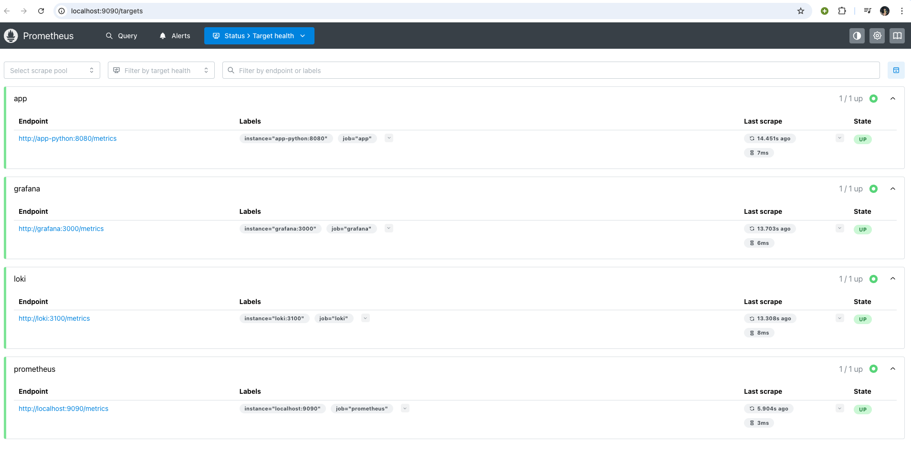
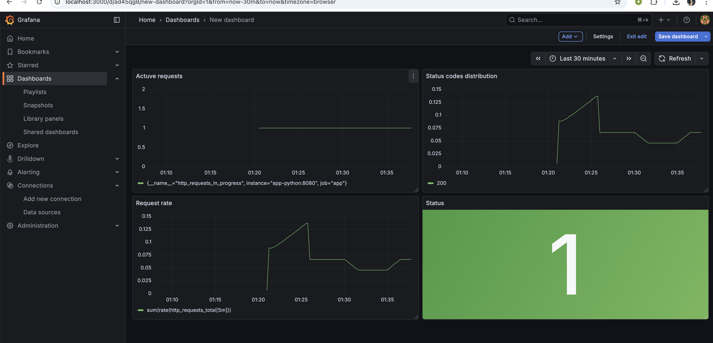

# Lab 8 — Metrics & Monitoring with Prometheus

## 1. Architecture
*App exposes /metrics endpoint -> Prometheus continuously scrapes the endpoint to read the metrics and saves them in the TSDB -> Grafana connects to Prometheus as a Data source to visualize metrics data via Dashboards.*

## 2. Application Instrumentation
Added endpoints and tracked requests and app features:
* `http_requests_total` - Counter. Total number of incoming HTTP requests to analyze traffic volume.
* `http_request_duration_seconds` - Histogram. Response latency (duration) of HTTP requests to measure API performance.
* `http_requests_in_progress` - Gauge. Active HTTP requests to show concurrency.
* `devops_info_endpoint_calls` - Counter. Simple call count on critical business endpoints.
* `devops_info_system_collection_seconds` - Histogram. Distribution of sysinfo collection time.

## 3. Prometheus Configuration
Prometheus configuration uses `scrape_interval: 15s`. Targets mapped:
* `prometheus` - localhost:9090
* `app` - app-python:8080
* `loki` - loki:3100
* `grafana` - grafana:3000

Retention limit is set in the `docker-compose.yml` to `10GB`.

## 4. Dashboard Walkthrough
The custom application dashboard consists of:
1. **Request Rate**: `sum(rate(http_requests_total[5m])) by (endpoint)` to see requests per second per route.
2. **Error Rate**: `sum(rate(http_requests_total{status_code=~"5.."}[5m]))` to monitor 5xx failures.
3. **Request Duration p95**: `histogram_quantile(0.95, rate(http_request_duration_seconds_bucket[5m]))` for tail latency observation.
4. **Request Duration Heatmap**: `rate(http_request_duration_seconds_bucket[5m])` representing visual spread of responses.
5. **Active Requests**: `http_requests_in_progress` showing request spike and queuing.
6. **Status Code Distribution**: `sum by (status_code) (rate(http_requests_total[5m]))` visualizing successful vs missed endpoints (200 vs 404 vs 500).
7. **Uptime**: `up{job="app"}` representing availability.

## 5. PromQL Examples
1. `rate(http_requests_total[5m])` - Gives request rate.
2. `sum(rate(http_requests_total{status_code=~"5.."}[5m]))` - Gets error rate for RED method.
3. `histogram_quantile(0.95, rate(http_request_duration_seconds_bucket[5m]))` - Yields 95th latency representation.
4. `up == 0` - Queries what instances are down.
5. `sum by (status_code) (rate(http_requests_total[5m]))` - Useful to build pies / donuts for response codes.

## 6. Production Setup
* **Health checks:** added via Docker options invoking health endpoints with `wget`.
* **Resources:** Added cpu and mem\_limits to standard 1G/1 CPU max for logging/monitoring backends, 512m/0.5 CPU for app and grafana.
* **Retention:** Limits Prometheus payload to standard 10GB for storage preservation.
* **Volumes:** `prometheus-data`, `grafana-data` and `loki-data` have been created to allow data preservation upon stack restarts.

## 7. Testing Results
*Screenshots confirming working state (add relevant screenshots here)*

